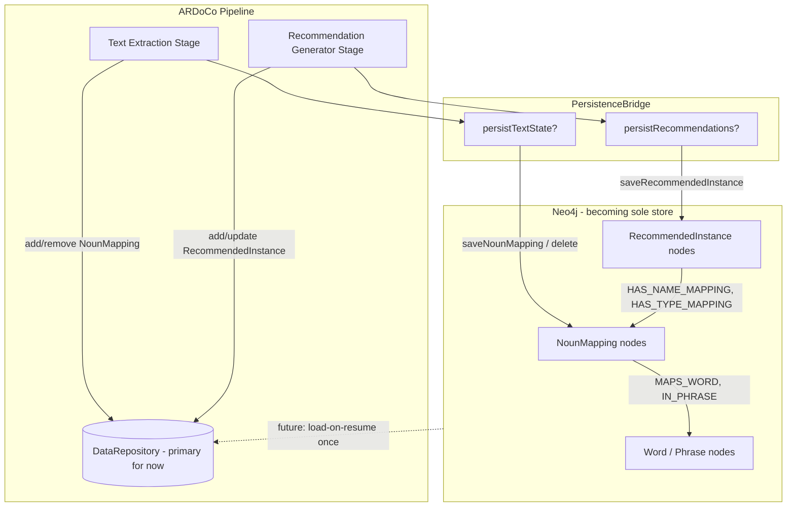

# Neo4j Persistence Extension — Plan & Progress Notes

**Author:** Tejas Redkar (HiWi)  
**Branch:** `feature/neo4j-textstate-recommendations` (based on Johanna Siegel’s `feature/neo4j`, tip `a582cf4e5`)  
**Last updated:** 2026-09-11  
**Status:** Phases 0–4 committed; steps 1–2 implemented locally (not committed); **architecture decisions locked (§7)** — revised roadmap in §8

This folder holds **internal working notes** for our Neo4j extension work. It is **not** the public wiki (`docs/`).

---

## 1. Goal

Extend Johanna Siegel’s Neo4j persistence layer ([PR #134](https://github.com/ardoco/ardoco/pull/134), branch `feature/neo4j`) so that **every DataRepository state** can live in Neo4j.

### End vision (locked)

| Horizon | Architecture |
|---|---|
| **End state** | **Neo4j is the sole store** for pipeline data. The full DataRepository flow moves onto Neo4j. |
| **Today / near term** | **Both run side by side**: in-memory `DataRepository` + optional Neo4j dual-write. |
| **Dual-write** | **Transitional scaffolding only** — not the permanent design. Reviewers must not treat dual-write as the final architecture. |

Migration path: dual-write → resume load-from-Neo4j → gradually cut over stages → Neo4j sole store.

**Supervisor / agreed technical direction:**

- Continue Johanna’s **Spring Data Neo4j** stack (`@Node`, mappers, `Neo4jRepository`, `PersistenceHandler`, `PersistenceBridge`) — but **keep hand-written Cypher until read-back** (see §7.1).
- New states need **write + read-back** (no permanent write-only slices).
- Keep **`ardocoId`** as the stable application id (`@Id`); switch NounMapping generation to **UUID** (or Neo4j-generated) before resume (see §7.3).
- Do **not** merge to `main` / `feature/neo4j` until **fault isolation** is fixed (see §7.5).

---

## 2. Architecture (how persistence fits the pipeline)

```
Pipeline stages
    → read/write DataRepository (in-memory blackboard)
    → optional dual-write via PersistenceBridge
        → PersistenceHandler (interface in core/framework/common)
        → Neo4jPersistenceHandler (neo4j-schema module)
        → type-specific *PersistenceService
        → Neo4j graph
```

| Concept | What it is |
|---|---|
| **DataRepository** | In-memory store for all pipeline step data (`TextState`, `ModelStatesData`, trace links, …). Still the primary runtime store. |
| **PersistenceBridge** | Singleton config gate + static access to `PersistenceHandler` from TLR stages. |
| **PersistenceHandler / Neo4jPersistenceHandler** | The “DAO” layer in supervisor terms — not a class literally named DAO. |
| **Dual-write** | Pipeline logic unchanged; after in-memory mutation, optionally mirror to Neo4j. |

**Important:** Nothing dumps the entire `DataRepository` as one blob. Johanna’s work + ours are **complementary slices** of persistence coverage.

### What Johanna already persists (write + read-back)

| Data | Neo4j nodes / edges |
|---|---|
| Preprocessed text | `Text`, `Sentence`, `Word`, `Phrase`, dependencies |
| Architecture / code models | Component / code entity nodes |
| Trace links | `TRACES_TO`, etc. |
| Inconsistencies | `Inconsistency` nodes |

### What we added (write-only so far)

| Data | Neo4j nodes / edges |
|---|---|
| TextState | `NounMapping` — `MAPS_WORD`, `HAS_REFERENCE_WORD`, `IN_PHRASE` |
| RecommendationStates | `RecommendedInstance` — `HAS_NAME_MAPPING`, `HAS_TYPE_MAPPING` → `NounMapping` |

---

## 3. Configuration flags

All default to **`false`** so existing Johanna tests stay unchanged.

| Config key | Meaning |
|---|---|
| `PersistenceBridge::usePersistence` | Master switch; requires Neo4j module active (`Neo4jBridgeActivator`). |
| `PersistenceBridge::persistTextState` | Dual-write `NounMapping` on add/remove/merge. |
| `PersistenceBridge::persistRecommendations` | Dual-write `RecommendedInstance` on add/update. **Implies TextState** (see bugs section). |

**Local Neo4j (Desktop):**

- Browser: `http://localhost:7474`
- Bolt: `bolt://127.0.0.1:7687` (tests use `127.0.0.1`, not `localhost`, on Windows)
- User / password: `neo4j` / `password123`
- DBMS name: `ardocolocal`

**Test pause (Browser inspection):** `-Dardoco.neo4j.pauseSeconds=N`  
**Test teardown:** `@AfterEach` runs `MATCH (n) DETACH DELETE n` — data is **not** kept between tests.

---

## 4. Phases / stages

### Phase 0 — Baseline ✅

**Goal:** Confirm local Neo4j + existing SWATTR persistence test works.

- Verified ~20 `TRACES_TO` links with Johanna’s trace-link persistence.
- Established `AbstractPersistenceTest` base (Spring Boot test context, dynamic Neo4j properties, graph wipe, optional pause).

---

### Phase 1 — Stable `ardocoId` on NounMapping ✅

**Goal:** Every `NounMapping` gets a stable id so Neo4j can upsert/delete the same node across merges.

**Problem:** Text extraction frequently **merges** two mappings into a new Java object. Without a preserved id, Neo4j would treat every merge as a new node.

**Solution:** `IdentifierProvider.createId()` on creation; on merge, keep the **earliest** mapping’s id via `NounMappingImpl.ardocoIdOfEarliest(...)`.

**No Neo4j writes in this phase** — identity only.

---

### Phase 2 — TextState dual-write ✅

**Goal:** When `persistTextState` is on, mirror `NounMapping` lifecycle to Neo4j.

**Graph schema:**

- Node: `NounMapping { ardocoId, reference, kind, probability, isCompound, surfaceForms, nameProbability, typeProbability }`
- Relationships to existing preprocessing nodes:
  - `MAPS_WORD` → `Word` (matched by `Word.position`)
  - `HAS_REFERENCE_WORD` → `Word`
  - `IN_PHRASE` → `Phrase`

**Hooks:** `TextStateImpl.addNounMapping` / `removeNounMapping` call `PersistenceBridge` when flag is on.

---

### Phase 3 — RecommendationStates dual-write ✅

**Goal:** When `persistRecommendations` is on, mirror `RecommendedInstance` to Neo4j.

**Graph schema:**

- Node: `RecommendedInstance { ardocoId, name, type, probability, metamodel }`
- `HAS_NAME_MAPPING` / `HAS_TYPE_MAPPING` → `NounMapping` (matched by `ardocoId`)

**Hooks:**

- `RecommendationStateImpl` — persist on new instance add
- `RecommendedInstanceImpl` — re-persist on probability / mapping updates

**Id model:** `RecommendedInstance` uses **UUID** (`Entity` id), not `IdentifierProvider`.

---

### Phase 4 — Persistence tests ✅

**Goal:** Automated flag gating tests for SWATTR dual-write.

**Test class:** `TextStateRecommendationPersistenceTest`

| Test | Expectation |
|---|---|
| All flags off | No `NounMapping` / `RecommendedInstance`; trace links still written |
| TextState on | NounMappings + word links; no recommendations |
| Both flags on | NounMappings + RecommendedInstances + `HAS_NAME_MAPPING` |

---

### Phase 5 — Review fixes (steps 1 & 2) ✅ locally, not committed

Agreed with supervisor review to fix two issues **before** Spring Data rewrite / read-back.

#### Step 1 — Phrase linking fix ✅

**Bug:** `IN_PHRASE` matched `Phrase` by `{ text, phraseType }`. Phrase text is **not unique** in a document (same surface string can appear in multiple phrases).

**Fix:** Match `Phrase` by **exact set of direct `CONTAINS_WORD` positions** (+ `phraseType` filter). Same stable keys as `Word` nodes from preprocessing.

**File:** `TextStatePersistenceService.java`  
**Test addition:** Assert `IN_PHRASE > 0` when TextState flag is on.

#### Step 2 — Flag dependency enforcement ✅

**Bug:** Enabling `persistRecommendations` without `persistTextState` caused silent failure — `HAS_NAME_MAPPING` / `HAS_TYPE_MAPPING` could not resolve `NounMapping` nodes.

**Fix:** In `PersistenceBridge.delegateApplyConfigurationToInternalObjects`, auto-enable `persistTextState` with an INFO log when recommendations are on alone.

**Tests:**

- `PersistenceBridgeTest` (unit, no Neo4j)
- `testSwattrRecommendationsOnlyAutoEnablesTextState` (integration)

---

### Phase 6+ — Revised roadmap (decisions locked 2026-09-11)

Former “blocked on professor” steps are unblocked by §7. See **§8** for the full ordered plan.

| Step | Topic | Status |
|---|---|---|
| A | Commit steps 1–2 | ✅ Committed |
| B | NounMapping → UUID (resume-safe ids) | ✅ Done (local) |
| C | `RecommendedInstanceImpl(name, type, id)` | ✅ Done (local) |
| D | Load-on-resume + Spring Data rewrite (together) | ✅ Done (local) |
| E | Fault isolation (merge gate) | ✅ Done (local) |
| F | Round-trip / resume tests | ✅ Done (local) |
| G | ConnectionState next (not NER) | ✅ Done (local) |
| H | Merge → `feature/neo4j` | After E + process OK |
| I | Neo4j sole store; remove dual-write scaffolding | **End vision** |

---

## 5. What is completed vs. in progress

| Item | Status |
|---|---|
| Stable `NounMapping.ardocoId` + merge preservation | ✅ Committed; **UUID generation** (step B) done locally |
| `NounMapping` / `RecommendedInstance` Neo4j schema entities + repos | ✅ Committed (repos unused for writes yet) |
| Cypher-based write services | ✅ Committed — **keep until read-back** (§7.1) |
| Dual-write hooks in TextState + Recommendation stages | ✅ Committed — **transitional**, not final (§1) |
| Config flags on `PersistenceBridge` | ✅ Committed |
| Integration tests (Phase 4) | ✅ Committed |
| Phrase linking by word positions (step 1) | ✅ Committed (`e6231bca2`) |
| Flag auto-enable (step 2) | ✅ Committed (`e6231bca2`) |
| Architecture decisions (§7) | ✅ Locked 2026-09-11 |
| NounMapping → UUID (or Neo4j-generated id) | ✅ Done (local; await commit) |
| `RecommendedInstanceImpl(name, type, id)` constructor | ✅ Done (local; await commit) |
| Load-on-resume for TextState / Recommendations | ✅ Done (local; await commit) |
| Spring Data rewrite (as part of read-back) | ✅ Done (local; await commit) |
| Fault isolation (Neo4j down → pipeline continues) | ✅ Done (local) |
| ConnectionState coverage (next state after NM+RI) | ✅ RI→Architecture instance links + load-on-resume (local) |
| Full DataRepository → Neo4j sole store | ❌ End vision |

**Browser verification (SWATTR, both flags on):** ~125 `NounMapping`, ~121 `RecommendedInstance`, ~125 `HAS_NAME_MAPPING`.

---

## 6. Bugs found and resolved

### 6.1 Phrase linking ambiguity (step 1) — **fixed locally**

| | |
|---|---|
| **Symptom** | Wrong or missing `IN_PHRASE` edges when duplicate phrase text exists. |
| **Root cause** | Cypher `MATCH (p:Phrase {text: $text, phraseType: $phraseType})` is not unique. |
| **Fix** | Match phrase by collected `CONTAINS_WORD` positions equal to mapping’s contained words. Skip empty position lists; warn if no match. |
| **File** | `core/neo4j-schema/.../TextStatePersistenceService.java` |

### 6.2 Recommendations without TextState (step 2) — **fixed locally**

| | |
|---|---|
| **Symptom** | `persistRecommendations=true` + `persistTextState=false` → RecommendedInstances without resolvable name/type links. |
| **Root cause** | No dependency enforcement at config application time. |
| **Fix** | Auto-enable `persistTextState` in `PersistenceBridge` when recommendations are enabled. |
| **File** | `core/framework/common/.../PersistenceBridge.java` |

### 6.3 Missing SLF4J logger (Phase 3) — **fixed in commit**

| | |
|---|---|
| **Symptom** | Compile error on `feature/neo4j` tip — `logger` undefined in `RecommendationStatesImpl`. |
| **Fix** | Added `Logger` field + `LoggerFactory.getLogger(...)`. |
| **File** | `tlr/stages-tlr/recommendation-generator/.../RecommendationStatesImpl.java` |

### 6.4 Known limitations / open issues

| Issue | Notes | Plan |
|---|---|---|
| **Write-only** TextState / Recommendations | Dual-write only; no load yet | Load-on-resume (§7.2), then sole-store cutover |
| **Cypher vs Spring Data split** | Entities/repos exist; writes use Cypher | Keep Cypher until read-back; rewrite together (§7.1) |
| **NounMapping JVM `IdentifierProvider`** | Counter resets per process → **ID collisions on resume** | Switch to UUID (like RI) or Neo4j-generated **before** resume (§7.3) |
| **No RI predefined-id constructor** | Needed for mapper `toDomain` | Add `(name, type, id)` — approved safe (§7.4) |
| **Fault isolation gap** | Neo4j down + flag on → whole pipeline crashes | Fix before merge to `feature/neo4j` (§7.5) |
| **TraceLinks “replace-every-read”** | `ConnectionState` / Johanna pattern couples every get to Neo4j | **Do not copy** for TextState/RI; keep as exception |

---

## 7. Architecture decisions (answered — locked)

Former open questions. Answers locked **2026-09-11**. Dual-write is transitional; Neo4j sole store is the end vision (§1).

### 7.1 Spring Data timing — rewrite before or after read-back?

**Decision: Keep hand-written Cypher for now.**

Rewriting to Spring Data before read-back would mean mapping work twice (write-only Cypher shape ≠ load shape; e.g. `loadSentenceModelTraceLinks` differs from a simple `save`).

**Plan:** Do the Spring Data rewrite **as part of implementing read-back** uniformly across states. Do not rewrite TextState/Recommendation write services early.

### 7.2 Read-back strategy — replace-in-memory vs dual-write + load-on-resume?

**Decision: Dual-write + load-on-resume** for `NounMapping` / `RecommendedInstance` (near term).

| Approach | Use for |
|---|---|
| **Replace-every-read** (Johanna `ConnectionState` / trace links) | Existing exception — stronger coupling; **do not copy** for TextState/RI |
| **Dual-write + load once on resume** | TextState / RecommendationStates: load into memory at pipeline start if state missing; during a live run, Neo4j is write-only |

Long term still moves to **Neo4j as sole store**; load-on-resume is the bridge, not the end.

### 7.3 Identifier scoping — JVM `IdentifierProvider` OK across runs?

**Decision: Not OK as-is for resume.**

JVM-local counters reset on process restart → colliding ids if the same Neo4j graph is reused. Correctness bug waiting for Step 4b.

- `RecommendedInstanceImpl` already uses `UUID.randomUUID()` — good pattern.
- **Before resume:** move `NounMapping` to UUID (or Neo4j-generated ids). Do not build resume on `IdentifierProvider` counters.

### 7.4 `RecommendedInstanceImpl(name, type, id)` — OK for mapper `toDomain`?

**Decision: Yes — safe.**

`equals` / `hashCode` / `compareTo` use **name + type only**, not `id`. A constructor that takes a predefined id does not break collection semantics. Add overload that passes `id` to `super` instead of `UUID.randomUUID()`.

### 7.5 Merge / PR timing

**Decision: Hold merge into `feature/neo4j` until fault isolation is fixed.**

If Neo4j is enabled but unreachable, the pipeline currently crashes. Persistence is meant to be optional → bad first impression. Who reviews first (Dominik / Johanna / professor) is a process call; the technical gate is fault isolation.

### 7.6 Next scope after NounMapping + RI?

**Decision: `ConnectionState` next — not NER.**

Reasons:

- Consumes `RecommendedInstance` (already dual-written).
- Produces architecture-side `TraceLink`s; `TraceLinkPersistenceService` already exists.
- Smallest incremental step (two of three dependencies covered).
- Defer `CodeTraceabilityState` and `NerConnectionState` (more standalone).

### 7.7 End vision — sole store or always-optional side store?

**Decision: End vision = Neo4j as the sole store.**

- Entire DataRepository flow should eventually live on Neo4j.
- **Right now:** keep DataRepository and Neo4j **side by side** (dual-write).
- Dual-write is **transitional scaffolding**, not the permanent architecture.
- Reviewers / future-you must not assume dual-write is the final design.

---

## 8. Revised roadmap (post-decision)

### Current position

```
[✅ Phases 0–4] Dual-write NM + RI (Cypher)
[✅ Steps 1–2] Phrase fix + flag enforcement (local)
[✅ Decisions] §7 locked
        │
        ▼
[A] Commit steps 1–2 + verify Neo4j
[B] NounMapping → UUID (prerequisite)
[C] RI predefined-id constructor
[D] Load-on-resume (TextState + Recommendations) + Spring Data rewrite together
[E] Fault isolation (Neo4j down ≠ pipeline crash)
[F] Round-trip / resume tests
[G] ConnectionState next (then Code / NER later)
[H] Merge to feature/neo4j (after E)
[I] Cut dual-write → Neo4j sole store (end vision)
```

| Step | Work | Depends on | Status |
|---|---|---|---|
| **A** | Commit phrase fix + flag auto-enable + plan notes | Manual Neo4j verify | ✅ `e6231bca2` |
| **B** | Switch `NounMapping` id generation from `IdentifierProvider` → **UUID** (keep `ardocoId` field + merge earliest-id) | — | ✅ Done (local) |
| **C** | Add `RecommendedInstanceImpl(name, type, id)` | — | ✅ Done (local) |
| **D** | Read-back: load TextState + RecommendationStates **once on resume**; rewrite Cypher → Spring Data mappers in the same effort | B, C | ✅ Done (local) |
| **E** | Fault isolation: persist failures / Neo4j down must not abort the pipeline | — | Can parallelize; **merge gate** |
| **F** | Tests: resume round-trip, IN_PHRASE, flag matrix, fault-isolation | D, E | |
| **G** | Extend coverage toward `ConnectionState` (links RI → TraceLinks already partially persisted) | D working | Next state after NM+RI |
| **H** | Merge branch → `feature/neo4j` | E + professor process OK | |
| **I** | Remove dual-write scaffolding; Neo4j sole store | Full coverage + confidence | **End vision** |

### What is no longer a blocker

Architecture questions in old §7 are **answered**. Work can resume at **A → B → C → D**. Spring Data rewrite is **deferred into D**, not a separate early rewrite.

### What still blocks merge / sole-store

1. **Fault isolation (E)** — blocks merge to `feature/neo4j`.
2. **UUID for NounMapping (B)** — blocks safe resume (D).
3. **Incomplete state coverage** — blocks sole-store cutover (I); ConnectionState is next after NM+RI resume path.

---

## 9. Files modified — by function

### 9.1 Committed (`4888ea597` — Phases 1–4)

#### API & identity

| File | Why modified |
|---|---|
| `core/framework/common/.../NounMapping.java` | Added `getArdocoId()` to the public API. |

#### Persistence wiring

| File | Why modified |
|---|---|
| `core/framework/common/.../PersistenceBridge.java` | Added `persistTextState`, `persistRecommendations` flags + static helpers `shouldPersistTextState()` / `shouldPersistRecommendations()`. |
| `core/framework/common/.../PersistenceHandler.java` | Added `saveNounMapping`, `deleteNounMapping`, `saveRecommendedInstance` to the handler contract. |
| `core/neo4j-schema/.../Neo4jPersistenceHandler.java` | Delegates new methods to TextState / Recommendation services. |
| `core/neo4j-schema/.../Neo4jInitializer.java` | Indexes on `NounMapping.ardocoId` and `RecommendedInstance.ardocoId`. |

#### Neo4j schema (Spring Data entities — used later in step D)

| File | Why modified |
|---|---|
| `core/neo4j-schema/.../entities/textextraction/NounMappingNode.java` | `@Node("NounMapping")` with relationships to `WordNode` / `PhraseNode`. |
| `core/neo4j-schema/.../entities/recommendation/RecommendedInstanceNode.java` | `@Node("RecommendedInstance")` with links to `NounMappingNode`. |
| `core/neo4j-schema/.../repository/textextraction/NounMappingRepository.java` | Spring Data repository (not used for writes yet). |
| `core/neo4j-schema/.../repository/recommendation/RecommendedInstanceRepository.java` | Spring Data repository (not used for writes yet). |

#### Write services (Cypher via Neo4jClient — keep until D)

| File | Why modified |
|---|---|
| `core/neo4j-schema/.../service/TextStatePersistenceService.java` | MERGE `NounMapping`, link words/phrases, delete on removal. |
| `core/neo4j-schema/.../service/RecommendationPersistenceService.java` | MERGE `RecommendedInstance`, link name/type mappings by `ardocoId`. |

#### TextState stage (dual-write hooks + identity)

| File | Why modified |
|---|---|
| `tlr/stages-tlr/text-extraction/.../NounMappingImpl.java` | Stable `ardocoId` field, predefined-id constructors, `ardocoIdOfEarliest()` for merges. |
| `tlr/stages-tlr/text-extraction/.../DefaultTextStateStrategy.java` | Merge creates new mapping with **earliest** `ardocoId` (Neo4j upsert stability). |
| `tlr/stages-tlr/text-extraction/.../TextStateImpl.java` | Calls `saveNounMapping` / `deleteNounMapping` on add/remove when flag is on. |

#### Recommendation stage (dual-write hooks)

| File | Why modified |
|---|---|
| `tlr/stages-tlr/recommendation-generator/.../RecommendationStateImpl.java` | Persist new recommended instances. |
| `tlr/stages-tlr/recommendation-generator/.../RecommendedInstanceImpl.java` | Re-persist on probability / mapping updates; sets metamodel for persistence context. |
| `tlr/stages-tlr/recommendation-generator/.../RecommendationStatesImpl.java` | Added missing SLF4J logger (compile fix). |

#### Tests

| File | Why modified |
|---|---|
| `tlr/tests-tlr/.../AbstractPersistenceTest.java` | Shared Neo4j test base: properties, graph wipe, pause helper, flag injection into config. |
| `tlr/tests-tlr/.../TextStateRecommendationPersistenceTest.java` | Phase 4 flag scenarios for SWATTR. |
| `tlr/tests-tlr/.../TraceLinkPersistenceTest.java` | Minor pause/Browser URL constant alignment. |
| `tlr/tests-tlr/.../CodePersistenceTest.java` | Same test infra tweaks. |
| `tlr/tests-tlr/.../DocumentationPersistenceTest.java` | Same test infra tweaks. |

---

### 9.2 Local only (steps 1–2, not committed)

| File | Change |
|---|---|
| `core/neo4j-schema/.../TextStatePersistenceService.java` | Phrase linking by word positions; warnings for empty/unmatched phrases. |
| `core/framework/common/.../PersistenceBridge.java` | Auto-enable `persistTextState` when recommendations enabled; updated Javadoc. |
| `tlr/tests-tlr/.../TextStateRecommendationPersistenceTest.java` | `IN_PHRASE` assertion; new test for recommendations-only flag. |
| `tlr/tests-tlr/.../AbstractPersistenceTest.java` | Removed duplicate `|| persistRecommendations` in test helper (enforcement now in bridge). |
| `core/framework/common/src/test/.../PersistenceBridgeTest.java` | **New** unit tests for flag dependency. |

---

## 10. Data flow (today: transitional dual-write)



**Target (end vision):** pipeline stages read/write Neo4j (via PersistenceHandler); DataRepository dual-write scaffolding removed.

---

## 11. How to run tests

**Unit (no Neo4j):**

```powershell
mvn -pl core/framework/common -am test `
  "-Dtest=PersistenceBridgeTest" `
  "-Dsurefire.failIfNoSpecifiedTests=false" `
  "-Dflatten.skip=true"
```

**Integration (Neo4j Desktop must be RUNNING):**

```powershell
mvn -pl tlr/tests-tlr -am test `
  "-Dtest=TextStateRecommendationPersistenceTest" `
  "-Dsurefire.failIfNoSpecifiedTests=false" `
  "-Dflatten.skip=true"
```

**With Browser pause (5 minutes):**

```powershell
mvn -pl tlr/tests-tlr -am test `
  "-Dtest=TextStateRecommendationPersistenceTest#testSwattrWritesRecommendedInstancesWhenBothFlagsOn" `
  "-Dsurefire.failIfNoSpecifiedTests=false" `
  "-Dflatten.skip=true" `
  "-Dardoco.neo4j.pauseSeconds=300"
```

---

## 12. Git / branch notes

| Item | Value |
|---|---|
| Feature branch | `feature/neo4j-textstate-recommendations` |
| Base commit (Johanna tip) | `a582cf4e5` |
| Our commit (Phases 1–4) | `4888ea597` |
| Uncommitted | Steps 1–2 review fixes + `PersistenceBridgeTest` + this plan doc |
| Remote | Pushed by user; **no merge** to `feature/neo4j` or `main` until fault isolation (§7.5) |

---

## 13. Immediate next actions

1. **Commit E+F+G** — fault isolation, resume/fault tests, ConnectionState RI→Architecture persistence + hydrate.
2. **H** — Merge to `feature/neo4j` when professor/process OK (fault isolation was the technical merge gate).
3. **I** — Cut dual-write → Neo4j sole store (end vision); more states as needed.
4. **Do not** treat dual-write as final.