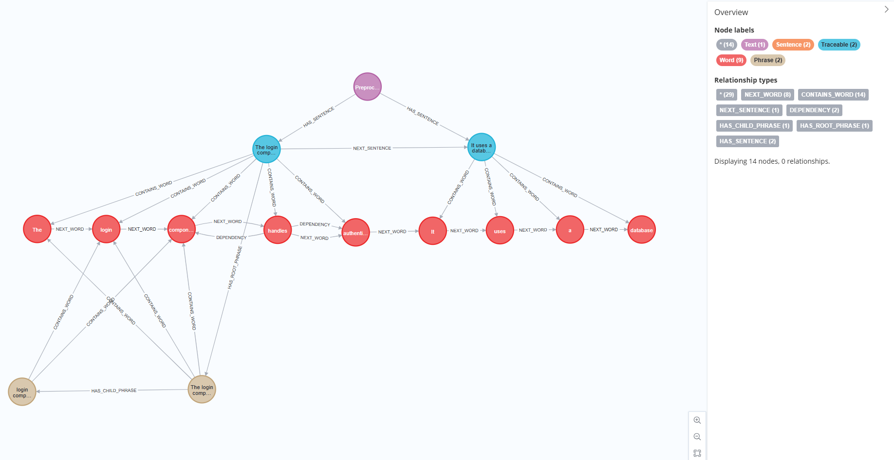
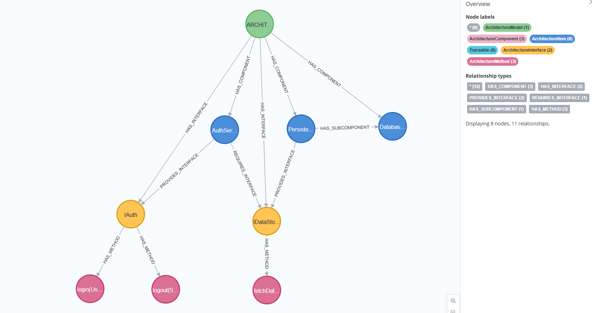
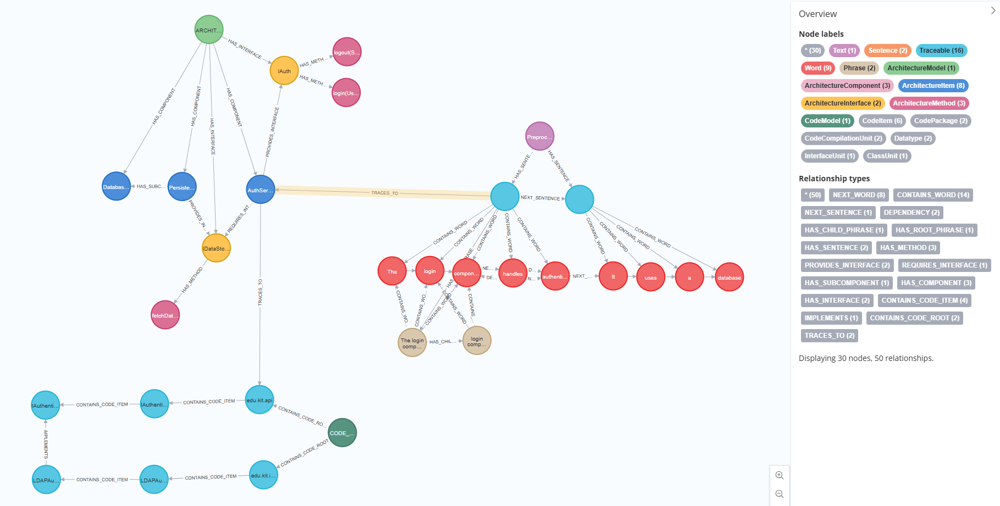

# Neo4j-Schema
This component provides functionality to save and load architecture models, code models and preprocessed texts in a Neo4j graph database.
Moreover it provides functionality to insert and retrieve tracelinks and inconsistencies.
The component is designed to be used in conjunction with other components of the Ardoco Core, such as the Architecture Model and Code Model components.

## Neo4j
Neo4j is a graph database. It stores data as nodes, relationships and properties. [Official Documentation](https://neo4j.com/docs/)
The idea of using neo4j in Ardoco is to model the architecture model, code model and documentation model as graphs as well as the tracelinks and inconsistencies between them in order to apply Machine Learning methods to it.

## Configuration options for the Neo4j database
The connection to the Neo4j database is configured via environment variables, which can be set in a .env file located in the project root.
This allows the neo4j module to be easily switched on or off. Moreover the deployment location can be changed without code changes.

``ARDOCO_PERSISTENCE_NEO4J_ENABLED:`` A boolean flag (true/false). Defaults to true. When set to true, the Neo4jBridgeActivator is initialized and plugs the handler into the ArDoCo Core. When false, the persistence layer remains inactive, allowing ArDoCo to run without a database connection.
Once Ardoco is running with this flag set to true, individual Runners can still choose to not use the persistence layer by setting the `PersistenceBridge::usePersistence` flag to false in their run configuration. This allows for flexible usage of the persistence layer on a per-run basis.

``SPRING_NEO4J_URI``: The connection string for the database (e.g., bolt://localhost:7687 for local Docker or a remote IP for deployed instances). Defaults to bolt://localhost:7687.

``SPRING_NEO4J_AUTHENTICATION_USERNAME`` & ``SPRING_NEO4J_AUTHENTICATION_PASSWORD``: The credentials for database access.

## Architecture
The architecture of the Neo4j-Schema component has a layered architecture. The main layers are:
1. Neo4jPersistenceHandler Class: provides the main entry point for interacting with the Neo4j database and the neo4j-schema module in general. 
    It provides methods for saving, loading and deleting architecture models, code models and preprocessed texts, as well as for inserting, retrieving and deleting tracelinks and inconsistencies.
2. Services: provides services for saving, loading and deleting architecture models, code models and preprocessed texts, as well as for inserting, retrieving and deleting tracelinks and inconsistencies.
3. Mappers: provides functionality for converting between the representation of the architecture model, code model and preprocessed text in ArDoCo and the representation in neo4j.
3. Repositories: provides repositories for interacting with the Neo4j database. 

### Data Representation:
The database schema is modelled as a graph. The modelled nodes and relationships of the graph can be found in the entities package.
Each class in the entities package ending with `Node` represents a node in the graph.
The classes each class ending with `Relationship` represent a relationship with additional properties in the graph. 
This only applies to the TraceLinkRelationship and the DependencyRelationship, which represents relationships between individual words.
All other relationships in the graph are represented as simple relationships which are directly annotated in the node classes with @Relationship.

Note: When creating Relationships in Neo4j, they are directed. However, in ArDoCo, tracelinks are undirected.
The relationships in neo4j can be traversed in both directions at the same speed. 
Thus, instead of creating two relationships for each tracelink, I created only one relationship to minimize the number of relationships needed.

In neo4j a node can have multiple labels, meaning inheritance can be represented in the graph by giving a node multiple labels.
The structure of the architecture model represented in the neo4j graph is similar to the structure of the architecture model in architectural model in ArDoCo including inheritance. 
This means every node in the architecture model has the `ArchitectureItem` label, and depending on the type of architecture item, it also has for example a `ArchitectureComponent`, `ArchitectureInterface` or `ArchitectureMethod` label.
Similarly, the structure of the code model represented in the neo4j graph is similar to the structure of the code model in ArDoCo. 
This means every node in the code model has the `CodeItem` label, and depending on the type of code item, it also has for example a `CodeComponent`, `CodeInterface` or `CodeMethod` label.
Similar goes for the preprocessed text.
Corresponing to the `Entity` class in ArDoCo, there is a `Traceable` label in the graph which is given to all nodes which can be traced. 
This means all meaning all nodes with the labels `CodeItem`, `ArchitectureItem` or `Sentence` automatically also wear the `Traceable` label.
This additional label allows to better define Tracelinkrelationships, which can be established between any two nodes with the `Traceable` label without having to define a separate relationship for all tracelink combinations.

#### Mapping between ArDoCo and Neo4j
To map between the representation of the architecture model, code model and preprocessed text in ArDoCo and the representation in neo4j, each of the 
models has a corresponding mapper class which provides methods for converting a model or text from ArDoCo to neo4j and vice versa.

For the text, the original TextImpl, SentenceImpl, WordImpl and PhraseImpl classes in `corenlp\TextImpl.java` have an object from NLP Processing as a field, 
which is not stored in neo4j. Thus, instead of repopulating these classes, I created new adapter 
classes `Neo4jText`, `Neo4jSentence`, `Neo4jWord` and `Neo4jPhrase` which also implement the Text, Sentence, Word and Phrase interfaces,
but do not have the NLP Processing object as a field.

For the classes of the architecture model and code model, I reused the same classes as in ArDoCo, but added a constructor to them which allows to
pass a predefined id to them instead of generating a new id to keep the same id as before saving the models to neo4j.

### Integration of Neo4j-Schema in Ardoco
Neo4j-Schema uses spring boot and spring data neo4j to interact with the neo4j database.
As soon as the spring boot application is started the Neo4jBridgeActivator class is activated.
This class populates the PersistenceBridge in Ardoco Core with an instance of the Neo4jPersistenceHandler class, which provides the main entry point for interacting with the neo4j database and the neo4j-schema module in general.
The PersistenceBridge is a singleton class which provides a bridge between the Ardoco Core and the persistence layer, which in this case is the neo4j database.
Like this other components of Ardoco can interact with the neo4j database via the PersistenceBridge without having to know about the neo4j-schema module.

#### Usage of the Neo4jPersistenceHandler

## Schema
### Preprocessed Text
The graph for representing a preprocessed text follows a structure similar to the one provided by TextImpl.java, SentenceImpl.java, WordImpl.java and PhraseImpl.java
in ArDoCo.
The main node is the `PreprocessedText` node.
The image below shows an example of how a preprocessed text is represented in the graph, 
where the `PreprocessedText` node is connected to `Sentence` nodes, which are further connected to `Word` and `Phrase` nodes.

### Architecture Model
The graph for representing an architecture model follows a structure similar to the one provided ArchitectureItem, ArchitectureComponent,
ArchitectureInterface and ArchitectureMethod in ArDoCo.
The main node is the `ArchitectureModel` node.
The image below shows an example of how an architecture model is represented in the graph.

### Code Model

### Tracelinks
Tracelinks are represented in the graph as relationships between nodes of the architecture model, nodes of the code model and sentence nodes of preprocessed text.
All the nodes between which a tracelink can be established also have the `traceable` label.
The relationship between tracelinks is called `TRACES_TO` and has the properties `traceLinkType`, which specifies the Type of Tracelink such as
`ARCHITECTURE_CODE` or `SENTENCE_ARCHITECTURE`  and `confidence` which represents the confidence of the tracelink (if given).
Transitive Tracelinks are not explicitly represented in the graph, but can be inferred by traversing the graph. 
For example, if there is a tracelink between an architecture component and a code component, and there is a tracelink between the code component and a sentence, 
we can infer that there is a transitive tracelink between the architecture component and the sentence.

Since neo4j only allows to have directed relationships, 
TODO: explain how we handle the fact that tracelinks are undirected in ArDoCo but neo4j only allows directed relationships.

The image below shows an example of how tracelinks are represented in the graph.

## Future Work
- Improve speed of retrieving models from the database
- Improve speed of inconsistency saving and retrieving

