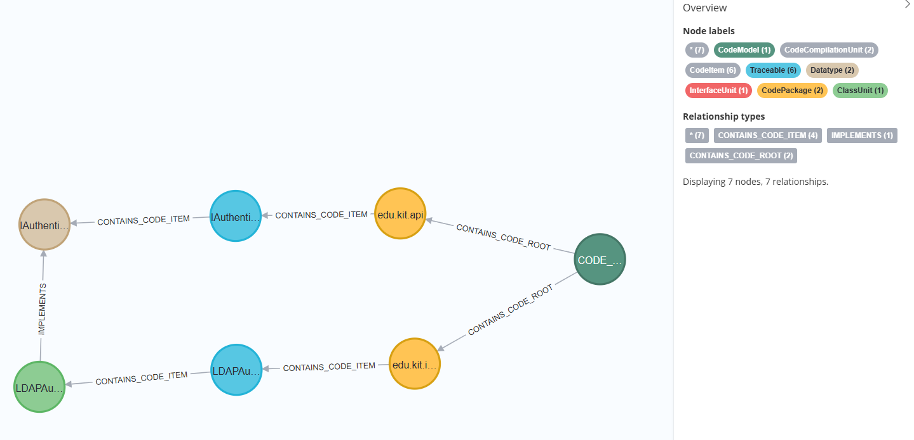
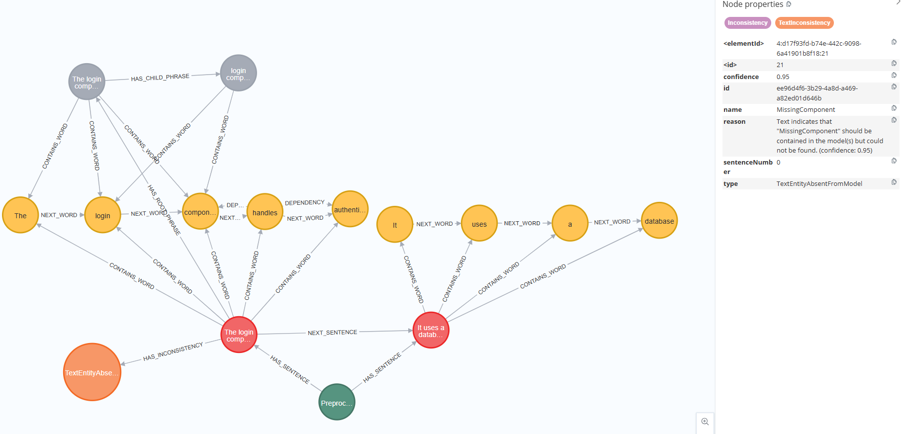
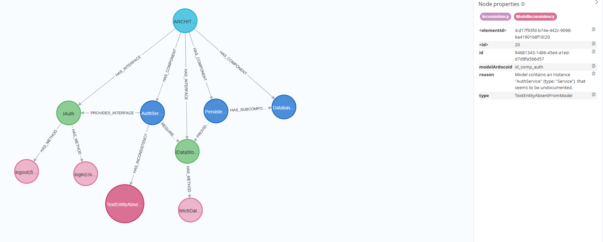

# Neo4j-Schema
This component provides functionality to save and load architecture models, code models and preprocessed texts in a Neo4j graph database.
Moreover, it provides functionality to insert and retrieve tracelinks and inconsistencies.
The component is designed to be used in conjunction with other components of the ARDoCo Core, such as the Architecture Model and Code Model components.

## 1. Overview
The idea of using neo4j in ARDoCo is to model the architecture model, code model and documentation model as graphs as well as the tracelinks and 
inconsistencies between them in order to apply Machine Learning methods to it.
The documentation of neo4j can be found here: [Official Documentation](https://neo4j.com/docs/). 
Neo4j stores  data as nodes, relationships and properties.

## 2. Configuration options
The connection to the Neo4j database is configured via environment variables, which can be set in a `.env` file located in the project root.
This allows the neo4j module to be easily switched on or off. Moreover, the deployment location can be changed without code changes.

- ``ARDoCo_PERSISTENCE_NEO4J_ENABLED:`` A boolean flag  to enable/ disable the Neo4j bridge. Defaults to true.
- ``SPRING_NEO4J_URI``: The connection URI for the neo4j instance. Defaults to bolt://localhost:7687.
- ``SPRING_NEO4J_AUTHENTICATION_USERNAME``: Username for database authentication. Defaults to "neo4j".
- ``SPRING_NEO4J_AUTHENTICATION_PASSWORD``: Password for database authentication. Defaults to "password".

Note:
Even when globally enabled, individual Runners can bypass the persistence layer by setting the 
`PersistenceBridge::usePersistence` flag to false in their specific configuration.

## 3. Architecture
The architecture of the Neo4j-Schema follows a layered architecture pattern:
1. `Neo4jPersistenceHandler` The central entry point into the neo4j-module for saving, loading, and deleting models, text, tracelinks, and inconsistencies.
2. **Services**:Domain-specific logic for managing persistence operations.
3. **Mappers**: Classes responsible for converting ARDoCo domain objects into Neo4j entities and vice versa.
4. **Repositories**: Spring Data Neo4j interfaces for database interaction.

### Integration of Neo4j-Schema in ARDoCo
Neo4j-Schema uses spring boot and spring data neo4j to interact with the neo4j database.
As soon as the spring boot application is started the `Neo4jBridgeActivator` class is activated.
This class registers the `Neo4jPersistenceHandler` into the ARDoCo Core `PersistenceBridge` singleton. 
This allows other ARDoCo components to interact with the database without direct knowledge of the Neo4j-Schema module.

## 4. Data Representation & Schema
A visualization of the graph schema can be found at the end of this file.

### 4.1 Nodes
- **Traceable:** A core label given to all nodes that can participate in a tracelink. This means all meaning all nodes with the labels `CodeItem`, `ArchitectureItem` or `Sentence` automatically also wear the `Traceable` label. 
- This additional label allows to better define TracelinkRelationships, which can be established between any two nodes with the `Traceable` label without having to define a separate relationship for all tracelink combinations.

- Inheritance like in the ARDoCo models is represented through multiple labels. For example, a node may have both `ArchitectureItem` and `ArchitectureComponent` labels.

- The modelled nodes and relationships of the graph can be found in the entities package. Each class in the entities package ending with `Node` represents a node in the graph.

### 4.2  Relationships
- **Directionality:** While Neo4j relationships are directed, ARDoCo tracelinks are conceptually undirected. 
To minimize the number of relationships needed, only one relationship is created per link, as it can be traversed in both directions at equal speed in neo4j.
- The classes each class ending with `Relationship` represent a relationship with additional properties in the graph.
- **TRACES_TO - Relationship**: Connects Traceable nodes and includes properties for traceLinkType and confidence.
- **HAS_INCONSISTENCY - Relationship**: Connects Traceable nodes to InconsistencyNode types (Text or Model inconsistencies).

### 4.3 Mapping between ARDoCo and Neo4j
To map between the representation of the architecture model, code model and preprocessed text in ARDoCo and the representation in neo4j, each of the 
models has a corresponding mapper class which provides methods for converting a model or text from ARDoCo to neo4j and vice versa.

For the text, the original TextImpl, SentenceImpl, WordImpl and PhraseImpl classes in `corenlp\TextImpl.java` have an object from NLP Processing as a field, 
which is not stored in neo4j. Thus, instead of repopulating these classes, I created new adapter 
classes `Neo4jText`, `Neo4jSentence`, `Neo4jWord` and `Neo4jPhrase` which also implement the Text, Sentence, Word and Phrase interfaces,
but do not have the NLP Processing object as a field.

For the classes of the architecture model and code model, I reused the same classes as in ARDoCo, but added a constructor to them which allows to
pass a predefined id to them instead of generating a new id to keep the same id as before saving the models to neo4j.


## 5. Performance Optimizations
- **Pagination**: DocumentationPersistenceService uses manual pagination to retrieve sentences in batches (default size: 100), avoiding large individual query overhead.
- **Direct Persistence**: InconsistencyPersistenceService optimizes save operations by persisting data directly rather than mapping to a Java object first.
- **Caching**: ModelStates.java implements a cache to avoid redundant database fetches after the initial load.

## 6.  Tests
Tests in the neo4j-schema module directly primarily test the Neo4jPersistenceHandler class and the neo4j-schema module in general.

Tests in` tlr/tests-tlr/.../neo4jschema` test the end-to-end Runners for Tracelink and Inconsistency retrieval. 
To verify whether the pipelines which use the neo4j-schema module work as expected, these tests check whether 
the number of expected tracelinks and inconsistencies match with the number of tracelinks and inconsistencies retrieved of the traceview-website.
Currently, these numbers are hardcoded in the tests.

### 6.1 Debugging Neo4j Tests
In order to debug Neo4j tests it may help to look at the visual representation of the graph. To do so, you can use the Neo4j Browser.

To access the Neo4j Browser, you can follow these steps:

1. Select the test you want to debug in your IDE and set a breakpoint where you want to inspect the graph.
2. In order to get the connection details for the Neo4j Browser, you can for example add a print statement in your test to output
   the connection details (e.g., URI, username, password) when the test runs. For example, you can add the following code snippet to the beginning of
   your test method:
```
        // --- VISUALIZATION BLOCK ---
        System.out.println("----------------------------------------------------------");
        System.out.println("neo4j browser: " + neo4jContainer.getHttpUrl()); // e.g., http://localhost:32789
        System.out.println("password:      " + neo4jContainer.getAdminPassword());
        System.out.println("Connect URL:   " + neo4jContainer.getBoltUrl());
        System.out.println("----------------------------------------------------------");
```
3. Run the test in debug mode. When the execution hits the breakpoint, it will pause, allowing you to inspect the state of the application.
4. Open the Neo4j Browser in your web browser by navigating to the Connected URL printed in the console (e.g., http://localhost:32789).
5. Log in to the Neo4j Browser using the username (usually "neo4j") and the password printed in the console.
6. Once logged in, you can execute Cypher queries to explore the graph.

## 7. Implementation Remarks & Future Work

### Future Work
- Improve speed of retrieving models from the database
- Improve speed of inconsistency saving and retrieving
- Currently, the `getTransitiveTracelinks()` method only retrieves transitive tracelinks from Sentence to Code with an architecture item as intermediate node.
  In case other types of transitive tracelinks are needed the `loadTransitiveTraceLinks()` Method in the TraceLinkPersistenceService class needs to be extended.

### Further Implementation Remarks
The class `ConnectionstateImpl.java` in ARDoCo has a `getTraceLinks()` method and a `addToLinks()` method which work together for SentenceModelTracelinks.
However, only for SentenceArchitecture tracelinks, getTraceLinks returns the actual final SentenceArchitecture tracelinks.
SentenceCode tracelinks from this method will get further processed by `ArchitectureLinkToCodeLinkTransformerInformant.java` and
then saved in the CodeTraceAbilityState. Thus, in `connectionstateImpl.java`, `addToLinks()` only adds SentenceArchitecture tracelinks to neo4j, but not SentenceCode tracelinks.
Similarly, `getTraceLinks()` only retrieves SentenceArchitecture tracelinks from neo4j.

To store the models, the models are saved with their Metamodeltype. Only one model per Metamodeltype can be stored in the database. If a model of the same type is already stored, it will be overwritten.
Thus, to load a model, it is enough specify the metamodel for which a model should be loaded. This is important to keep the method signature
of the `getModel(Metamodel metamodel)` method in ModelStates.java unchanged.


## 8. Visualization of the Graph Structure
### Preprocessed Text
The graph for representing a preprocessed text follows a structure similar to the one provided by TextImpl.java, SentenceImpl.java, WordImpl.java and PhraseImpl.java
in ARDoCo.
The main node is the `PreprocessedText` node.
The image below shows an example of how a preprocessed text is represented in the graph, 
where the `PreprocessedText` node is connected to `Sentence` nodes, which are further connected to `Word` and `Phrase` nodes.


### Architecture Model
The graph for representing an architecture model follows a structure similar to the one provided ArchitectureItem, ArchitectureComponent,
ArchitectureInterface and ArchitectureMethod in ARDoCo.
The main node is the `ArchitectureModel` node.
The image below shows an example of how an architecture model is represented in the graph.


### Code Model
The graph for representing a code model follows a structure similar to the one provided CodeItem, CodeComponent, CodeInterface and CodeMethod in ARDoCo.
The main node is the `CodeModel` node.
The image below shows an example of how a code model is represented in the graph.


### Tracelinks
Tracelinks are represented in the graph as relationships between nodes of the architecture model, nodes of the code model and sentence nodes of preprocessed text.
All the nodes between which a tracelink can be established also have the `traceable` label.
The relationship between tracelinks is called `TRACES_TO` and has the properties `traceLinkType`, which specifies the Type of Tracelink such as
`ARCHITECTURE_CODE` or `SENTENCE_ARCHITECTURE`  and `confidence` which represents the confidence of the tracelink (if given).
Transitive Tracelinks are not explicitly represented in the graph, but can be inferred by traversing the graph. 
For example, if there is a tracelink between an architecture component and a code component, and there is a tracelink between the code component and a sentence, 
we can infer that there is a transitive tracelink between the architecture component and the sentence.

The image below shows an example of how tracelinks are represented in the graph.


### Inconsistencies
Inconsistencies are represented in the graph as relationships between Traceable nodes and an InconsistencyNode which can be a TextInconsistency or a ModelInconsistency.
The images below show an example of how inconsistencies are represented in the graph.
TextInconsistencies:


ModelInconsistencies:



