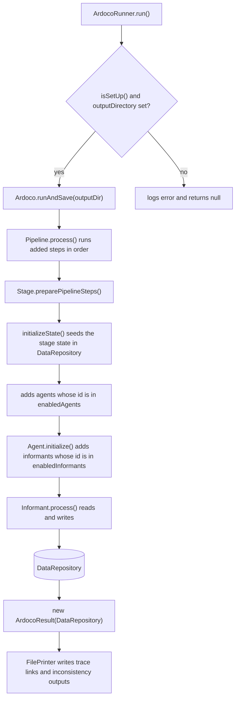

# Architecture

This page covers ARDoCo's pipeline architecture, data model, and intermediate artifacts. For the original wiki pages, see [Pipeline.md](../docs/Pipeline.md) and [Intermediate-Artifacts.md](../docs/Intermediate-Artifacts.md).

The one invariant to keep in mind: **pipeline components communicate only through the shared `DataRepository`**. Stages, agents, and informants receive the same repository instance at construction, read inputs and write results under string identifiers, and never call each other directly. The only other cross-cutting mechanism is the configuration system, which pushes values into `@Configurable` fields down the same composite hierarchy.

## Pipeline Composite Pattern

ARDoCo's pipeline follows a **composite pattern** with three levels of hierarchy:

```
Ardoco (extends Pipeline)
  └── AbstractExecutionStage (Level 1: Stage)
        └── PipelineAgent (Level 2: Agent)
              └── Informant (Level 3: actual computation)
```

### Core Classes

| Class | Source | Role |
|-------|--------|------|
| `AbstractPipelineStep` | `core/framework/common/.../pipeline/AbstractPipelineStep.java` | Base class for all pipeline components; extends `AbstractConfigurable`, provides the lifecycle (`before()` → `process()` → `after()` via `run()`), logging, and the `DataRepository` reference |
| `Pipeline` | `core/framework/common/.../pipeline/Pipeline.java` | Composite container that executes added steps sequentially in `process()`, logs per-step timing, and sets `hasFinished()` in `after()`; `preparePipelineSteps()` re-delegates configuration to children |
| `AbstractExecutionStage` | `core/framework/common/.../pipeline/AbstractExecutionStage.java` | Specialized `Pipeline` for stages; final `preparePipelineSteps()` calls `initializeState()`, then adds only agents listed in `enabledAgents` |
| `PipelineAgent` | `core/framework/common/.../pipeline/agent/PipelineAgent.java` | A `Pipeline` + `Agent` that runs a list of `Informant`s; final `initialize()` adds only informants listed in `enabledInformants` |
| `Informant` | `core/framework/common/.../pipeline/agent/Informant.java` | Abstract `AbstractPipelineStep` implementing `Claimant`; performs the actual computation inside an agent |
| `Claimant` | `core/framework/common/.../pipeline/agent/Claimant.java` | Marker interface for classes that claim intermediate results; `Confidence` tracks the contributing `Claimant`s |

### Three-Level Hierarchy

1. **Stages** — high-level pipeline phases (e.g., `TextExtraction`, `RecommendationGenerator`, `ConnectionGenerator`, `InconsistencyChecker`)
2. **Agents** — each stage contains multiple agents; an agent initializes its state and coordinates its informants
3. **Informants** — concrete `AbstractPipelineStep` implementations that execute specific heuristics or algorithms and write their results into the repository

Execution is strictly sequential and depth-first: a stage's `process()` runs its agents one after another, and each agent runs its informants one after another. Steps are added during preparation (`preparePipelineSteps()`), so gating via `enabledAgents`/`enabledInformants` happens at run time, not construction time.



*Stage → agent → informant execution over the `DataRepository` blackboard, and the `runAndSave` data flow from runner to saved output files.*

## DataRepository (Blackboard)

All pipeline steps share one central **DataRepository** (`core/framework/common/.../data/DataRepository.java`):

- It is a sorted map of `String` identifier → `PipelineStepData`, and the repository itself is `Serializable`.
- `getData(id, class)` returns an `Optional<T>`: empty when the identifier is unknown or the stored data cannot be cast to the requested class (`PipelineStepData.asPipelineStepData`).
- `addData(id, data)` overwrites silently but logs a warning when an identifier is reused — states are usually written once per stage.
- Well-known identifiers are declared as `ID` constants on the state interfaces (e.g., `TextState.ID`, `ModelStates.ID = "ModelStatesData"`, `ProjectPipelineData.ID`, `PreprocessingData.ID`).
- `PipelineStepData` also offers `serialize()`/`deserialize()` JSON helpers built on the shared `JsonHandling.createObjectMapper()`.

Because every component holds the same repository instance, heuristic cooperation works without direct coupling: multiple informants contribute complementary analyses into the same states, later steps read earlier results, and intermediate results remain observable for debugging. `DataRepositorySyncer` is the one sanctioned cross-state hook (it propagates noun-mapping deletions into all recommendation states).

## Execution Entry Points

| Class | Source | Role |
|-------|--------|------|
| `Ardoco` | `core/pipeline-core/.../execution/Ardoco.java` | Main pipeline entry point; extends `Pipeline` with id `"ARDoCo"`, creates its own `DataRepository`, and seeds `ProjectPipelineData` with the project name; `runAndSave(outputDir)` runs the pipeline and writes output files |
| `ArdocoRunner` | `core/pipeline-core/.../execution/runner/ArdocoRunner.java` | Abstract runner wrapping an `Ardoco` instance; owns the `isSetUp` flag and the output directory; final `run()`/`runWithoutSaving()` guard on it |
| `AnonymousRunner` | `core/pipeline-core/.../execution/runner/AnonymousRunner.java` | Abstract `ArdocoRunner` subclass for tests; the constructor calls `setUp()`, which invokes the abstract `initializePipelineSteps(dataRepository)` and adds the returned steps to `Ardoco` |
| `ArdocoResult` | `core/pipeline-core/.../api/output/ArdocoResult.java` | Record wrapping the `DataRepository` after execution; the public typed read API for trace links, inconsistencies, models, and text |

Concrete runners wire actual pipelines and live in the application modules: `Arcotl`/`Swattr`/`Transarc`/`Artemis` in `tlr/pipeline-tlr/.../execution/` and `InconsistencyDetection` in `inconsistency-detection/pipeline-id/.../execution/runner/`. Each provides a `setUp(...)` that adds its pipeline steps to `getArdoco()`, sets the output directory via the protected `setOutputDirectory(...)`, and then flips `isSetUp = true`.

### Runner contract

- `ArdocoRunner.run()` is final and returns `@Nullable ArdocoResult`: it calls `Ardoco.runAndSave(outputDirectory)` only when `isSetUp()` is true **and** an output directory was set; otherwise it logs an error and returns `null`.
- `ArdocoRunner.runWithoutSaving()` requires only `isSetUp()`; it runs the pipeline and returns the raw `DataRepository` (not a result wrapper), writing nothing to disk.
- `AnonymousRunner` performs setup eagerly in its constructor. `setUp()` catches `IOException` from `initializePipelineSteps` and reports `isSetUp = false` in that case; implementers load input data and return the `List<AbstractPipelineStep>` to execute.
- `Ardoco.runAndSave(outputDir)` itself returns `null` when no steps were added (pipeline never defined). After a successful run it constructs `new ArdocoResult(getDataRepository())` and writes, via `FilePrinter`: `traceLinks_<project>.txt` (human-readable trace links), `inconsistencyDetection_<project>.txt`, and — per link type, only when non-empty — `sadSamTlr_<project>.csv`, `samCodeTlr_<project>.csv`, `sadCodeTlr_<project>.csv`.

### ArdocoResult

`ArdocoResult(DataRepository dataRepository)` is the typed façade over the repository:

- `getProjectName()`, `getText()`, `getMetamodels()`, `getModelState(metamodel)`
- Trace links: `getTraceLinksForModel(metamodel)`, `getArchitectureTraceLinks()`, `getSamCodeTraceLinks()`, `getSadCodeTraceLinks()`, `getAllTraceLinksAsBeautifiedStrings()`
- Inconsistencies: `getAllInconsistencies()`, `getAllTextInconsistencies()`, `getAllModelInconsistencies()`, `getInconsistentSentences()`, `getAllInconsistenciesForModel(metamodel)`

State accessors degrade gracefully: when `ConnectionStates`, `InconsistencyStates`, or the code-traceability state are absent from the repository, the accessor logs a warning and returns `null` (and derived accessors return empty collections). In contrast, `getPreprocessingData()` throws when the text was never preprocessed.

## Configuration System

All pipeline components extend `AbstractConfigurable` (`core/framework/common/.../configuration/AbstractConfigurable.java`), which is also the base of `AbstractPipelineStep` — so every stage, agent, informant, and state is configurable. Fields annotated with `@Configurable` can be overridden at runtime, enabling fine-grained control over thresholds, filters, and algorithm parameters without code changes.

### Key resolution and supported types

- `applyConfiguration(ImmutableSortedMap<String, String>)` reflects over declared fields of the class hierarchy (stopping at `Object`/`AbstractConfigurable`), applies values for matching keys, then delegates the same map to child components.
- The default key is `<SimpleClassName>::<fieldName>` (`CLASS_ATTRIBUTE_CONNECTOR = "::"`); a custom key can be set via `@Configurable(key = "...")`. With `@ChildClassConfigurable`, the key uses the **concrete** subclass name instead of the declaring class, so inherited fields are configurable per subclass (combining both on one field throws).
- `@NoConfiguration` on a class skips that class level entirely.
- Supported field types: `Integer`, `Double`, `Boolean`, enums (by constant name), and `List<String>` (values separated by `LIST_SEPARATOR = ","`). Other types are rejected.

### File format and defaults

`ConfigurationHelper.loadAdditionalConfigs(File)` (in `core/pipeline-core/.../execution/`) parses UTF-8 text files with one `KEY::attribute=VALUE` per line, e.g. `ConnectionGenerator::initialFilters=true` (blank lines are skipped, malformed lines are logged). `ConfigurationHelper.getDefaultConfigurationOptions()` reflects over all concrete `AbstractConfigurable` subclasses under `edu.kit.kastel.mcse.ardoco` (excluding tests), instantiates each, and records every `@Configurable` field's default value as a string — this is how the full set of tunable options is discovered.

### Configuration flows down the composite

Configuration is applied top-down through the same composite that executes steps: `Pipeline.delegateApplyConfigurationToInternalObjects` applies the map to each step, `AbstractExecutionStage` additionally applies it to all agents, and `PipelineAgent` to all informants. Because agents and informants are only added as pipeline steps during `preparePipelineSteps()`, each `Pipeline` re-applies its `getLastAppliedConfiguration()` there — a configuration applied to a stage before the run reaches every enabled agent and informant. Stages and agents therefore expose static factories like `TextExtraction.get(additionalConfigs, dataRepository)` that construct and then `applyConfiguration`.

### Gating: stages gate agents, agents gate informants

- `AbstractExecutionStage` declares `@Configurable @ChildClassConfigurable List<String> enabledAgents`, initialized to the ids of all constructor-provided agents; at run time only agents whose id is in the list are added as pipeline steps.
- `PipelineAgent` declares `enabledInformants` the same way, defaulting to all informants.
- Commenting an id out of `enabledAgents`/`enabledInformants` (or overriding the key `<ClassName>::enabledAgents`) is the standard way to switch parts of the pipeline off without code changes.

### Enforcement

The ArchUnit test `configurableFieldsOnlyInConfigurableClasses` in `core/tests-base/.../tests/architecture/BasicArchitectureTest.java` enforces that `@Configurable` fields are declared only in classes assignable to `AbstractConfigurable` — configuration by reflection cannot silently escape the framework.

## Intermediate Artifacts

ARDoCo converts inputs into standardized intermediate representations that enable uniform analysis across different text sources, modeling languages, and programming languages. Everything is stored in the `DataRepository`: input text as `InputTextData`, the preprocessed `Text` inside `PreprocessingData` (`ID = "PreprocessingData"`), and all models inside `ModelStates` (`ID = "ModelStatesData"`), keyed by `Metamodel`.

### Text Representation

Internal model for natural language documentation preserving all NLP annotations from preprocessing (`core/framework/common/.../api/text/`):

- **Tokenization**: `Text` → `Sentence` → `Word` (word and sentence boundaries, positions)
- **Part-of-Speech Tags**: `Word.getPosTag()` (`POSTag`)
- **Dependency Parsing**: `Word.getOutgoingDependencyWordsWithType(...)` / incoming (`DependencyTag`)
- **Lemmatization**: `Word.getLemma()`
- **Phrases**: `Sentence.getPhrases()` (`Phrase`, `PhraseType`)

Interfaces: `Text`, `Word`, `Sentence`, `Phrase`, `POSTag`, `DependencyTag`; `NlpInformant` is the abstract `Informant` that supplies an annotated `Text`. A lightweight variant exists as `SimpleText`/`SimplePreprocessingData`.

### Software Architecture Models (SAM)

Unified representation of architecture models independent of the original modeling language (PCM, UML, component listing) — `core/framework/common/.../api/models/architecture/`:

| Element | Description |
|---------|-------------|
| `ArchitectureItem` | Sealed base (`permits` Component, Interface, Method); extends `ArchitectureEntity`, provides `name` and `id` |
| `ArchitectureComponent` | Components with provided/required interfaces, subcomponents, and a type |
| `ArchitectureInterface` | Interface contracts containing `ArchitectureMethod` signatures |
| `ArchitectureMethod` | Method declarations within interfaces |

**Hierarchy**: Component → provides/requires → Interface → contains → ArchitectureMethod. `ArchitectureModelWithComponentsAndInterfaces` holds the component/interface roots; its `getEndpoints()` returns the content, i.e. every root item is a trace-link target.

#### Architecture Model Serialization

Architecture models serialize to a stable JSON form for caching and reuse. `ArchitectureModel.createArchitectureModelDto()` (`.../api/models/ArchitectureModel.java`) walks the component/interface/method tree and produces an `ArchitectureModelDto` — a flat, id-keyed repository of DTOs plus the list of root content ids:

- **DTO package**: `core/framework/common/.../api/models/architecture/dto/` — `ArchitectureModelDto` (record: `id`, `ArchitectureItemRepository`), `ArchitectureItemRepository` (record: `repository` sorted map of id → item, `content` id list), and the sealed `ArchitectureItemDto` permitted set `ComponentDto`, `InterfaceDto`, `MethodDto`, discriminated in JSON by a `type` property (`"Component"`, `"Interface"`, `"Method"`). Each DTO stores only ids for its children (`subcomponentsIds`, `providedInterfacesIds`, `requiredInterfacesIds`, `methodSignaturesIds`), so the graph is reconstructable by id lookup.
- **`ArchitectureMethod`** has a `(name, id)` constructor so a serialized method retains its identifier rather than regenerating one.
- **Writer**: `ArchitectureExtractor.writeOutArchitectureModel(model, file)` (`tlr/stages-tlr/model-provider/.../generators/architecture/ArchitectureExtractor.java`) serializes via the shared `JsonHandling.createObjectMapper()` to the conventional `.aam` file name (`architectureModel.aam`).
- **Write-only today**: unlike the code model, no code path reads an `ArchitectureModelDto` back into an `ArchitectureModel`; the `.aam` output is a cache/export artifact. Add a reader before relying on deserialization.

When extending the architecture model, add any new item kind to the `ArchitectureItemDto` sealed permits list and handle it in `ArchitectureModel.collectItem` so it is covered by serialization.

### Code Model

Standardized representation of source code inspired by the [Knowledge Discovery Model (KDM)](https://www.omg.org/spec/KDM/1.3/PDF) — `core/framework/common/.../api/models/code/`:

| Category | Classes |
|----------|---------|
| **Module** | `CodeCompilationUnit` (source file; carries `pathElements`, `extension`, `language`, `importedModuleNames`), `CodePackage` (namespace), `CodeAssembly` (runnable unit; carries a `language` string and `importedModuleNames`) |
| **Datatype** | `Datatype` (sealed base) → `ClassUnit`, `InterfaceUnit`; owns content and `implementedTypes`/`extendedTypes` relationships |
| **ComputationalObject** | `ControlElement` (callable; carries 1-indexed `startLine`/`endLine` and `calleeNames`) |

All code elements inherit from `CodeItem` (which extends `CodeEntity`) and are registered in an id-keyed `CodeItemRepository`; content relationships store ids and resolve them via `getCodeItemsByIds(...)`. The model is rooted by `CodeModel` subclasses: `CodeModelWithCompilationUnits` and `CodeModelWithCompilationUnitsAndPackages` (see `Metamodel.CODE_WITH_COMPILATION_UNITS[_AND_PACKAGES]`).

#### Module imports and function callees

The code model records two cross-element relationships for call-graph and import analysis:

- **Imports** — `CodeCompilationUnit` and `CodeAssembly` each expose `getImportedModuleNames()`, a `@JsonProperty`-serialized `List<String>` of fully-qualified module/package names declared at the file/assembly level. `CodeCompilationUnit.fromRelativePath(...)` is a factory that derives `name`, `pathElements`, and `extension` from a forward-slash relative path (e.g. `src/foo/Bar.py`) and accepts the import list; it is used by the Python3 mapper, while the Java mappers assemble the constructor arguments directly.
- **Callees** — `ControlElement` exposes `getCalleeNames()`, a `@JsonProperty`-serialized `List<String>` of names invoked within the callable's body (e.g. `helper` and `TestClass` for a method that calls `helper()` and constructs `new TestClass()`).

Both fields default to empty lists (shell compilation units are extracted with an empty import list and no `ControlElement`s) and round-trip through the persisted `CodeModel`/`CodeModelDto`.

**Which extractors actually populate them today:** the wiring in `AllLanguagesExtractor` — the only code-extractor factory used in pipelines (`CodeConfiguration.extractors()` in DIRECTORY mode) — maps `ProgrammingLanguage.JAVA` to the Eclipse-JDT-based `JavaExtractor`/`JavaModel` and `ProgrammingLanguage.SHELL` to `ShellExtractor`/`ShellVisitor`. The JDT `JavaModel` fills `importedModuleNames` from import declarations and `calleeNames` from `MethodInvocation`/`ClassInstanceCreation` visitors. The ANTLR4 extractors and mappers for Java, C++, and Python3 (`.../generators/antlr/`) also populate both fields via `Element.getImports()`/`Element.getCalleeNames()`, but they are **not wired** into `AllLanguagesExtractor` or any other main-source pipeline — they are exercised by tests only. When activating a new code-extraction backend, populate `importedModuleNames` on the `CodeCompilationUnit`/`CodeAssembly` and `calleeNames` on each `ControlElement` so call-graph relationships stay consistent across languages.

### Source line ranges and content ownership

`Datatype` and `ControlElement` carry 1-indexed source line ranges to locate each element in its source file:

- `getStartLine()` / `getEndLine()` return the inclusive start and end line, or `-1` when the position is unknown (defaults, deserialized older models, or constructs without a concrete source span).
- The fields are `@JsonProperty`-serialized, so line ranges round-trip through the persisted `CodeModel`/`CodeModelDto`.

Two related structural properties of the code model:

- **`content` ownership** — the `content` id list, `getContent()`, `getContentIds()` (via `@JsonGetter("content")`), and `getAllDataTypes()` live on `Datatype` (`.../api/models/code/Datatype.java`), which also holds `compilationUnitId`, `parentDatatypeId`, and the extended/implemented/datatype-reference id lists. The sealed `Datatype` is the single source of truth; `ClassUnit`/`InterfaceUnit` only add type-specific constructors (including the `(content, startLine, endLine)` variants).
- **Model id persistence** — `Model` (`.../api/models/Model.java`) has a protected `Model(String id)` constructor (a `null` id falls back to `IdentifierProvider.createId()`), and `CodeModel.CodeModelDto` carries an `id` field, so a deserialized `CodeModel` retains its original id. `CodeModelWithCompilationUnits(dto)` and `CodeModelWithCompilationUnitsAndPackages(dto)` rebuild a model from the DTO. `equals`/`hashCode` on `Datatype` and `ControlElement` incorporate `startLine`/`endLine` (and, for `Datatype`, `content`); `ControlElement` further folds in `calleeNames`, and `CodeCompilationUnit` folds in `importedModuleNames`, so identity follows these relationship fields and deserialized instances stay identity-stable.

Code models round-trip end-to-end: `CodeExtractor.writeOutCodeModel(model)` serializes `createCodeModelDto()` to `codeModel.acm` next to the code, and `CodeExtractor.readInCodeModel(file, metamodel)` reconstructs the matching `CodeModel` subclass from it.

When extending the code model, add new fields on the appropriate base (`Datatype` for class-like members, `ControlElement` for callables), keep them `@JsonProperty`-annotated, and update the corresponding `equals`/`hashCode` so deserialized instances stay identity-stable.

### Entity Hierarchy

**Source**: `core/framework/common/.../api/entity/`

```
Entity (sealed; id + name, Serializable)
├── TextEntity
└── ModelEntity (sealed)
    ├── ArchitectureEntity
    └── CodeEntity
```

`Entity` provides identity (`IdentifierProvider`-generated id) and name; `ModelEntity` adds `getType()`/`getTypeParts()` used for name/type-based matching.

### Stage State Interfaces

Each pipeline stage has corresponding state interfaces stored in the DataRepository. Model-dependent stages use per-metamodel container states:

| Package | Key Interfaces | Repository ID |
|---------|----------------|---------------|
| `...api.stage.textextraction` | `TextState`, `NounMapping`, `PhraseMapping`, `MappingKind` | `TextState` |
| `...api.stage.connectiongenerator` | `ConnectionState`, `ConnectionStates`, `RecommendationModelTraceLink` | `ConnectionStates` |
| `...api.stage.connectiongenerator.ner` | `NerConnectionState`, `NamedArchitectureEntity` | `NerConnectionStates` |
| `...api.stage.recommendationgenerator` | `RecommendationState`, `RecommendedInstance`, `RecommendationStates` | `RecommendationStates` |
| `...api.stage.inconsistency` | `InconsistencyState`, `Inconsistency`, `ModelInconsistency`, `TextInconsistency` | `InconsistencyStates` |
| `...api.stage.codetraceability` | `CodeTraceabilityState`, `ArchitectureCodeTraceLink` | `CodeTraceabilityState` |

Container states (`ConnectionStates`, `RecommendationStates`, `InconsistencyStates`, `NerConnectionStates`) resolve the per-`Metamodel` state; `ArdocoResult` reads them back through the same IDs.

## Extending the Pipeline

To add a new approach or analysis step:

1. Implement a new `Informant` with your algorithm
2. Add it to an existing `PipelineAgent` or create a new one
3. Read required data from the `DataRepository` using the appropriate state interface
4. Store results back to the repository under a well-known identifier
5. Wire the agent into the pipeline stage or create a new `AbstractExecutionStage`

For approach-level composition (which stages form TLR or inconsistency pipelines), see [TLR Approaches](tlr-approaches.md) and [Inconsistency Detection](inconsistency-detection.md); for running pipelines from the CLI, see [Quickstart](quickstart.md) and [Operations](operations.md).

## Source Map

| Area | Key Path |
|------|----------|
| Pipeline framework | `/core/framework/common/src/main/java/.../core/pipeline/` |
| Data layer | `/core/framework/common/src/main/java/.../core/data/` |
| API interfaces (text, models, stage states) | `/core/framework/common/src/main/java/.../core/api/` |
| Execution entry points and configuration helper | `/core/pipeline-core/src/main/java/.../core/execution/` |
| Runners (`ArdocoRunner`, `AnonymousRunner`) | `/core/pipeline-core/src/main/java/.../core/execution/runner/` |
| Text provider (JSON) | `/core/framework/text-provider-json/` |
| Configuration | `/core/framework/common/src/main/java/.../core/configuration/` |
| Similarity utilities | `/core/framework/common/src/main/java/.../core/common/similarity/` |
| Model providers / extractors (SAM, code) | `/tlr/stages-tlr/model-provider/` |
| Architecture tests (`@Configurable` enforcement) | `/core/tests-base/src/main/java/.../core/tests/architecture/BasicArchitectureTest.java` |
