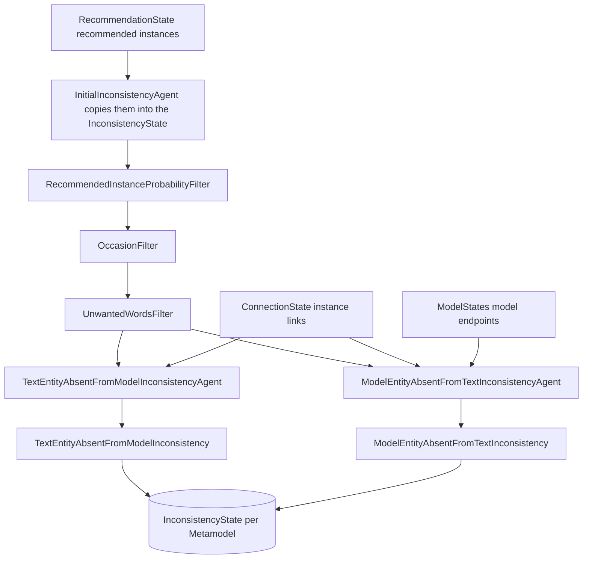

# Inconsistency Detection

ARDoCo's Inconsistency Detection (ID) identifies discrepancies between software architecture documentation (SAD) and the software architecture model (SAM). It reuses trace link recovery results as a bridge: once trace links connect documentation sentences to model elements, ID flags the "orphan" elements on both sides of that bridge. The implementation lives in the `inconsistency-detection` module (`io.github.ardoco.id`), whose stage is appended to the SWATTR pipeline.

> **Terminology note**: In ARDoCo V1 the two inconsistency kinds were called "Missing Model Elements" (MME) and "Unmentioned/Undocumented Model Elements" (UME). V2 renamed them to Text Entity Absent from Model (TEAM) and Model Entity Absent from Text (MEAT). The V1 names survive in file names, e.g., the `*_UME.csv` gold standards used by the evaluation.

## Inconsistency Types

### TEAM — Text Entity Absent from Model

Elements described in the documentation that cannot be traced to any model element.

- **Agent**: `TextEntityAbsentFromModelInconsistencyAgent`
- **Informant**: `TextEntityAbsentFromModelInconsistencyInformant`
- **Type class**: `TextEntityAbsentFromModelInconsistency` — a record `(name, sentence, confidence, origin)` implementing `TextInconsistency`
- **Type string**: `"TextEntityAbsentFromModel"`

**Detection logic** (`minSupport` configurable, default `1`):

1. Read the recommended instances that `InitialInconsistencyAgent` copied into the inconsistency state (already reduced by the pre-filters).
2. Remove every recommended instance that participates in a trace link, i.e., that appears as the first endpoint of an instance link in `ConnectionState.getInstanceLinks()`.
3. Additionally remove candidates whose words overlap with any linked recommended instance (they describe the same concept that is already linked).
4. Remaining candidates become `MissingElementInconsistencyCandidate`s with `ELEMENT_WITH_NO_TRACE_LINK` support; candidates that overlap each other accumulate `MULTIPLE_OVERLAPPING_RECOMMENDED_INSTANCES` support.
5. Candidates whose accumulated support is at least `minSupport` produce one `TextEntityAbsentFromModelInconsistency` **per distinct word** of the recommended instance, recording the word's 1-based sentence number (`getSentenceNumber() + 1`) and the recommended instance's probability as confidence.

### MEAT — Model Entity Absent from Text

Model elements that have no (or insufficient) corresponding documentation.

- **Agent**: `ModelEntityAbsentFromTextInconsistencyAgent`
- **Informant**: `ModelEntityAbsentFromTextInconsistencyInformant`
- **Type class**: `ModelEntityAbsentFromTextInconsistency` (implements `ModelInconsistency`, wraps the flagged `ModelEntity`)
- **Type string**: `"ModelEntityAbsentFromText"`

**Detection logic**:

1. Collect the distinct model entities that appear as second endpoints of instance links.
2. Walk all `Model.getEndpoints()` and keep entities of a targeted type whose link count is below `minimumNeededTraceLinks` (default `1`).
3. Remove whitelist matches: a whitelist entry is a regex that must **fully match** the entity name or any of its name parts; matching entities are excluded.
4. Each remaining candidate becomes one `ModelEntityAbsentFromTextInconsistency`.

**Configuration options**:

| Option | Default | Meaning |
|--------|---------|---------|
| `minimumNeededTraceLinks` | `1` | Minimum number of trace links to a model entity required to avoid being flagged |
| `whitelist` | `[]` | Regex patterns (full match on name or name parts) for entities to exclude |
| `types` | `["Component", "BasicComponent", "CompositeComponent"]` | Model entity types (or type parts) to check |

## Detection Flow



*Data flow through the `InconsistencyChecker`: recommended instances are pre-filtered by three informants before the TEAM and MEAT agents write inconsistencies into the per-metamodel inconsistency state.*

## Pipeline Entry Point

The end-to-end runner is `InconsistencyDetection` (`inconsistency-detection/pipeline-id/.../execution/runner/InconsistencyDetection.java`), an `ArdocoRunner` whose `definePipeline` wires:

```
TextPreprocessingAgent → ModelProviderAgent → TextExtraction → RecommendationGenerator → ConnectionGenerator → InconsistencyChecker
```

This is the SWATTR trace link recovery pipeline (see [TLR Approaches](tlr-approaches.md)) with the `InconsistencyChecker` stage appended. Two details matter:

- The runner pins the architecture `Metamodel` to `ARCHITECTURE_WITH_COMPONENTS_AND_INTERFACES` by constructing the `ArchitectureConfiguration` directly with that metamodel (unlike the TLR runners, whose `setUp` forbids a pre-set metamodel and then calls `withMetamodel(...)` itself; see [TLR Approaches](tlr-approaches.md)). Note the contrast with the SWATTR runner, which pins `ARCHITECTURE_WITH_COMPONENTS`.
- Blank input text is rejected up front with an `IllegalArgumentException`.

The runner contract (`isSetUp` flag, `run()` vs. `runWithoutSaving()`) is documented on [Architecture](architecture.md). Because both informants read `ConnectionStates`, `ModelStates`, and `InconsistencyStates` from the shared `DataRepository`, the `InconsistencyChecker` only produces results when the upstream stages have already run.

## InconsistencyChecker Stage

**Source**: `inconsistency-detection/stages-id/inconsistency-detection/src/main/java/edu/kit/kastel/mcse/ardoco/id/InconsistencyChecker.java`

`InconsistencyChecker` extends `AbstractExecutionStage` and constructs exactly three agents in this order:

1. `InitialInconsistencyAgent`
2. `TextEntityAbsentFromModelInconsistencyAgent` (TEAM)
3. `ModelEntityAbsentFromTextInconsistencyAgent` (MEAT)

Its `initializeState()` builds an `InconsistencyStatesImpl` and registers it in the `DataRepository` under `InconsistencyStates.ID` (`"InconsistencyStates"`). The static factory `InconsistencyChecker.get(additionalConfigs, dataRepository)` applies configuration before execution. As with every stage, agents can be switched off via the stage's `enabledAgents` configuration (see [Architecture](architecture.md)).

### Agent 1: InitialInconsistencyAgent (Pre-filtering)

`initializeState()` copies the recommended instances from the per-metamodel `RecommendationState` into the `InconsistencyState`. The agent then runs three filter informants. All of them extend the `Filter` base class, an `Informant` whose `process()` iterates the metamodels and rewrites the inconsistency state's recommended instances by calling the abstract `filterRecommendedInstances(InconsistencyState)`.

| Informant | Purpose | Key defaults |
|-----------|---------|--------------|
| `RecommendedInstanceProbabilityFilter` | Drops RIs with low probability | `threshold=0.5`, `dynamicThreshold=true`, `dynamicThresholdFactor=0.7`, `thresholdNameAndTypeProbability=0.3`, `thresholdNameOrTypeProbability=0.8` |
| `OccasionFilter` | Drops RIs that do not recur | `expectedAppearances=2` |
| `UnwantedWordsFilter` | Drops RIs with unwanted words | `enableCommonBlacklist=true`, custom/common word lists, common file endings |

**RecommendedInstanceProbabilityFilter**: with `dynamicThreshold=true`, the threshold is recomputed per run as `dynamicThresholdFactor × highest RI probability`. An RI survives if its probability exceeds the threshold **and** the name/type noun mapping probabilities pass one of the gates: name and type each above `thresholdNameAndTypeProbability`, or name above `thresholdNameOrTypeProbability`, or type above `thresholdNameOrTypeProbability`. (The two "or" gates compare the *same* highest type and name probabilities against `thresholdNameOrTypeProbability`, so the name gate can only fire for type mappings and vice versa — an implementation quirk of `checkProbabilitiesForNounMappingTypes`.)

**OccasionFilter**: counts how many *distinct text positions* the RI's name-mapping words occupy (consecutive word positions count as one position); the RI survives only if the count is at least `expectedAppearances`.

**UnwantedWordsFilter**: removes an RI when any name mapping's reference contains a blacklisted lemma, contains a plural-tagged word, consists only of numbers, or ends with a common file ending. It combines a configurable `customBlacklist` (default `meta`, `log`, `browser`, `task`, `operation`, `case`, `instance`, `script`) with a common blacklist loaded from the classpath resource `unwanted_words_filter_common.json` (e.g., `cpu`, `file`, `event`, `browser`, `instance`, `code`, `java`, `request`, `test`), plus a configurable list of `commonFileEndings` (e.g., `pdf`, `png`, `md`, `xml`, `java`, `gradle`). The source notes this filter is a prototype with documented improvement ideas.

### Agent 2: TextEntityAbsentFromModelInconsistencyAgent (TEAM)

A thin `PipelineAgent` wrapper around `TextEntityAbsentFromModelInconsistencyInformant`, which implements the five-step TEAM logic described above. Its only `@Configurable` is `minSupport` (default `1`).

### Agent 3: ModelEntityAbsentFromTextInconsistencyAgent (MEAT)

A thin `PipelineAgent` wrapper around `ModelEntityAbsentFromTextInconsistencyInformant`, which implements the MEAT logic and owns the three `@Configurable` options listed in the table above. Type targeting checks the entity's `type` and `typeParts` against the configured `types` list, so `"Component"` also matches a `BasicComponent`.

## State and Candidate Model

| Class | Role |
|-------|------|
| `InconsistencyStatesImpl` | `EnumMap<Metamodel, InconsistencyStateImpl>` container; `build()` creates one state per `Metamodel` value |
| `InconsistencyStateImpl` | `AbstractState` holding `recommendedInstances` and `inconsistencies` per metamodel |
| `MissingElementInconsistencyCandidate` | Wraps a `RecommendedInstance` plus the set of accumulated `MissingElementSupport`s |
| `MissingElementSupport` | Enum: `ELEMENT_WITH_NO_TRACE_LINK`, `TRACED_ELEMENT_IN_SAME_SENTENCE`, `DEPENDENCY_TO_TRACED_ELEMENT`, `MULTIPLE_OVERLAPPING_RECOMMENDED_INSTANCES` |

Behavioral notes:

- `InconsistencyStateImpl.addInconsistency` skips duplicates (equality per inconsistency type), so repeated word-level TEAM records with identical name/sentence/confidence collapse.
- The pre-filters do not just remove entries; they **replace** the state's recommended instances via `setRecommendedInstances`, which is why filter order (probability → occasion → unwanted words) defines a narrowing funnel.
- `MissingElementInconsistencyCandidate.getAmountOfSupport()` is the number of *distinct* support kinds; `equals`/`hashCode` are keyed only by the wrapped `RecommendedInstance`.
- Of the four support kinds, only `ELEMENT_WITH_NO_TRACE_LINK` and `MULTIPLE_OVERLAPPING_RECOMMENDED_INSTANCES` are currently produced; `TRACED_ELEMENT_IN_SAME_SENTENCE` and `DEPENDENCY_TO_TRACED_ELEMENT` are declared for future heuristics.

## Inconsistency Types and Output

`TextEntityAbsentFromModelInconsistency` is a record with `name`, `sentence` (1-based), `confidence`, and the originating `MissingElementInconsistencyCandidate`; equality compares name, sentence, and confidence. `ModelEntityAbsentFromTextInconsistency` wraps the `ModelEntity` and exposes its id via `getModelInstanceUid()`, which is what `ArdocoResult.getAllModelInconsistencies()` consumers (and the MEAT evaluation) compare against. Both provide `getType()`, a human-readable `getReason()`, and `toFileOutput()` entries; `FilePrinter.writeInconsistencyOutput` renders inconsistent sentences plus model inconsistency reasons into `inconsistencyDetection_<project>.txt` when the pipeline is run with output saving.

## Evaluation Harness

`InconsistencyDetectionEvaluationIT` (module `tests-inconsistency`) evaluates TEAM and MEAT on the benchmark projects of the `InconsistencyDetectionTask` enum: `MEDIASTORE`, `TEASTORE`, `TEAMMATES`, `BIGBLUEBUTTON`, and `JABREF` (see [Testing & Evaluation](testing.md) for run recipes and the EnumSource trick to run a single project).

### Hold-Back Runs

`HoldBackRunResultsProducer.produceHoldBackRunResults` simulates TEAM inconsistencies:

1. It extracts the PCM architecture once and creates a `HoldBackArCoTLModelProvider`.
2. The **base run** executes the full model and is stored in the result map under the `null` key.
3. For each architecture component (one per index), a further run removes exactly that component from the model, so every element is held back once; the gold-standard trace links to the held-back element mark the spots where a TEAM inconsistency *should* be found.

Each run is an `AnonymousRunner` with the pipeline `TextPreprocessingAgent → TextExtraction → hold-back model provider → RecommendationGenerator → ConnectionGenerator → InconsistencyChecker` (or `InconsistencyBaseline` for the baseline variant). `HoldBackArCoTLModelProvider.get()` supplies a `PipelineAgent` whose extractor returns the initial model minus the currently held-back component; a negative hold-back index means nothing is removed. Additional configs come from the project's filter list file (e.g., `/configurations/ms/filterlists_all.txt`).

### TEAM Evaluation (Order 1)

For every hold-back run, the test collects the TEAM inconsistency sentence numbers and compares them with the gold-standard sentences that mention the removed element (`getGoldstandardForArchitectureModel` reads the sentence-to-architecture CSV). `compareInconsistencies` computes a `SingleClassificationResult` via `ClassificationMetricsCalculator` (from the `io.github.ardoco:metrics` dependency pulled in by `core/tests-base`), using the number of sentences as the confusion matrix sum. Per-run results are aggregated with the **micro-average** and asserted against the project's `ExpectedResults` minimums (precision, recall, F1, accuracy, phi coefficient) — dropping below a minimum fails the build.

### Baseline (Order 5, environment-gated)

The baseline variant is only executed when the environment variable `testBaseline` is set to any value (`@EnabledIfEnvironmentVariable(named = "testBaseline", matches = ".*")`). It swaps `InconsistencyChecker` for the `InconsistencyBaseline` stage/agent/informant, which reports a TEAM inconsistency (empty name, fixed confidence `0.69`) for *every sentence that has no trace link* — a trivial upper-bound comparison point. Its weighted-average metrics are logged, not asserted.

### MEAT Evaluation (Order 10)

The MEAT test reuses the base run's `ArdocoResult` (cached from the TEAM run) and compares the UIDs of all reported `ModelInconsistency` instances against the project's unmentioned-model-element gold standard (`*_UME.csv`); explicit TP/FP/FN counts are logged.

### Output

All evaluation artifacts are written under `target/testout`:

- `ardoco_eval_id/inconsistencies_<PROJECT>.txt` and `detailed_inconsistencies_<PROJECT>.txt` (TEAM, per hold-back run with removed instance, metrics, and TP/FP/FN lists)
- `ardoco_eval_id/inconsistentModelElements_<PROJECT>.txt` (MEAT)
- `traceLinks_<PROJECT>.txt` and `inconsistencyDetection_<PROJECT>.txt` for the base run

## Testing Infrastructure

- **Unit tests** (`stages-id/inconsistency-detection/src/test/java/.../id/`): `types/AbstractInconsistencyTypeTest.java` plus `types/TextEntityAbsentFromModelInconsistencyTest.java` and `types/ModelEntityAbsentFromTextInconsistencyTest.java` verify type strings, equality, and (currently `@Disabled` because expected values change regularly) reason and file output; `agents/ModelEntityAbsentFromTextInconsistencyTest.java` covers the MEAT whitelist regex and type-targeting helpers.
- **Shared ArchUnit tests** (`tests-inconsistency`): `ArchitectureTest`, `ConfigurationTest`, and `DeterministicArdocoTest` extend the rule base classes from `core/tests-base`, enforcing the architecture rules, `@Configurable` validity, and determinism over `core`, `tlr`, and `id` packages.
- **Integration/evaluation**: `InconsistencyDetectionEvaluationIT` with the `integration/inconsistencyhelper/` support classes (`HoldBackArCoTLModelProvider`, `HoldBackRunResultsProducer`, `InconsistencyDetectionEvaluationUtil`) and the `eval/baseline/InconsistencyBaseline*` classes.

Run commands, environment variables, and the invariant that metric-affecting heuristic changes require deliberate expectation updates are covered on [Testing & Evaluation](testing.md); module build commands live on [Quickstart](quickstart.md) and [Operations](operations.md).

## Use Cases

- **Architecture Evolution**: identifying outdated or missing documentation during system evolution
- **Quality Assurance**: ensuring documentation completeness before releases
- **Onboarding**: helping new team members understand documentation gaps
- **Consistency Checking**: verifying alignment between informal documents and formal models
- **Reverse Engineering**: finding unmentioned components when analyzing existing systems
