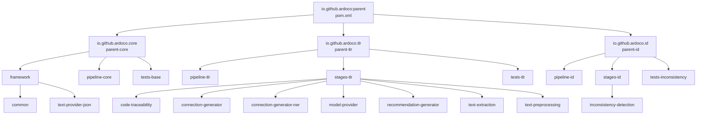
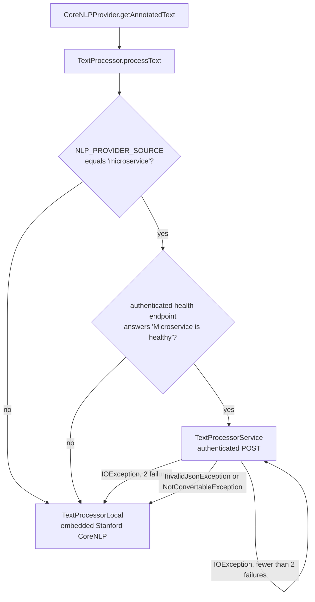

# Operations

This page covers everything needed to build, validate, and release the ARDoCo monorepo: the Maven build system and module matrix, pinned-plugin gotchas, code formatting and nullness tooling, CI/CD workflows, publishing, environment configuration, and the external services the project depends on. For pipeline internals see [Architecture](architecture.md), for the TLR stage landscape see [TLR Approaches](tlr-approaches.md), for the detection pipeline see [Inconsistency Detection](inconsistency-detection.md), and for a getting-started overview see [Quickstart](quickstart.md).

## Build System

### Prerequisites

- **JDK 21** or higher (`java.version` in the root [`pom.xml`](../pom.xml)); we advise at least 4 GB of RAM.
- **Maven 3.9** or higher.

Each module tree ships its own `.mvn/` configuration, so a plain `mvn` invocation inside `core/`, `tlr/`, or `inconsistency-detection/` already picks up tuned behavior:

- `.mvn/maven.config` runs Maven with `-T1C` (parallel builds per CPU core) and `-DskipTests=false` plus `-Dnet.bytebuddy.experimental=true`.
- `.mvn/jvm.config` starts the JVM with `-XX:+EnableDynamicAgentLoading -XX:-TieredCompilation -XX:TieredStopAtLevel=1`, `--add-exports` for the `jdk.compiler` packages, and `--add-opens java.base/java.lang` — required for the forking compiler and Mockito/ByteBuddy agent loading under JDK 21.

### Build Commands

```bash
mvn clean install     # Full build with tests, install to local repository
mvn clean verify      # Full build with tests, no install
mvn clean package     # Build without tests
```

The default `complete` profile is active in the root POM and in each module POM, so these commands build everything, including the test modules. Add `-Pdeployment` to build only the publishable modules (see [Module Matrix](#module-matrix)).

### Build Gotcha: Pinned `flatten-maven-plugin`

All POMs use CI-friendly version placeholders: the root POM sets `<revision>2.1.0-SNAPSHOT</revision>` and every module inherits it via `<version>${revision}</version>`. The root POM resolves these placeholders with `org.codehaus.mojo:flatten-maven-plugin`, which is **pinned to `1.7.3`**. Do **not** remove this pin or let it upgrade to the unversioned "latest" resolution (1.8.0): the 1.8.0 release has an upstream bug (`mojohaus/flatten-maven-plugin#523`) whose CI-friendly interpolator throws an NPE against this POM. The plugin runs with `flattenMode=resolveCiFriendliesOnly` and `updatePomFile=true`, expands `dependencyManagement` and `dependencies`, and executes at the `clean` and `process-resources` phases. This also means the deployed POMs carry fully resolved versions rather than `${revision}` placeholders.

## Module Matrix

The root POM (`io.github.ardoco:parent`) aggregates the three top-level trees; each tree has its own aggregator POM that narrows the module set per profile.



*Reactor hierarchy of the monorepo: three top-level trees, each with an aggregator POM and per-profile module lists.*

| Tree | POM | Aggregator modules |
|------|-----|--------------------|
| **Core** | [`core/pom.xml`](../core/pom.xml) | `framework` (aggregating `common`, `text-provider-json`), `pipeline-core`, `tests-base` |
| **TLR** | [`tlr/pom.xml`](../tlr/pom.xml) | `pipeline-tlr`, `stages-tlr` (aggregating `code-traceability`, `connection-generator`, `connection-generator-ner`, `model-provider`, `recommendation-generator`, `text-extraction`, `text-preprocessing`), `tests-tlr` |
| **ID** | [`inconsistency-detection/pom.xml`](../inconsistency-detection/pom.xml) | `pipeline-id`, `stages-id` (aggregating `inconsistency-detection`), `tests-inconsistency` |

**Profiles.** The `complete` profile (`activeByDefault=true`) is defined in the root POM and in each module POM and includes the test modules listed above. The explicit `deployment` profiles restrict each tree to its publishable modules (`core`: `framework`, `pipeline-core`, `tests-base`; `tlr`: `pipeline-tlr`, `stages-tlr`; `inconsistency-detection`: `pipeline-id`, `stages-id`), skip test compilation, and GPG-sign artifacts with the pinned KIT signing key (`2673EE7DF64D33426A93D642E88F0DA2FB06A126`). The root additionally carries a `deployment-parent` profile with the same build tweaks for the root POM itself. The `inconsistency-detection` tree also binds the JaCoCo Maven plugin for coverage instrumentation in its build.

## Key Dependencies

The root POM's `dependencyManagement` pins the versions shared by all modules:

| Dependency | Version | Role |
|------------|---------|------|
| Stanford CoreNLP | 4.5.10 | NLP preprocessing (declared in `text-preprocessing`, incl. the `models` classifier artifact) |
| Jackson (`jackson-bom`) | 2.22.2 | JSON serialization |
| Eclipse Collections | 13.0.0 | preferred collection types (enforced by ArchUnit) |
| JavaParser | 3.28.2 | Java code parsing |
| JUnit (Jupiter) | 6.1.3 | testing |
| Mockito | 5.23.0 | mocking |
| SLF4J | 2.0.18 | logging |
| ArchUnit (`archunit-junit5`) | 1.5.0 | architecture tests |
| ANTLR runtime | 4.13.2 | code-model parsers |
| `io.github.ardoco:metrics` | 0.3.0 | evaluation metrics (used by `tests-base`) |

The `versions-maven-plugin` (2.21.0) is configured to ignore `alpha`/`beta`/`RC` versions when checking for updates.

Two notable dependencies are **not** versioned in the root POM:

- **OpenNLP `opennlp-tools` 2.5.11** is pinned in `core/framework/common/pom.xml` (with its transitive `slf4j-api` excluded). OpenNLP's `PorterStemmer` is used by ArCoTL's `NameComparisonUtils` for stemming, and that utility also builds a local Stanford CoreNLP `tokenize,pos,lemma` pipeline for lemmatization-based name comparison.
- **`dev.langchain4j:langchain4j-bom` 1.18.1** is imported by `tlr/stages-tlr/model-provider/pom.xml` for the OpenAI and Ollama chat-model integrations (see [LLM Integration](#llm-integration-and-reproducibility)).

## Code Formatting

### Spotless

ARDoCo uses [Spotless](https://github.com/diffplug/spotless/tree/main/plugin-maven) (3.9.0, configured once in the root `pluginManagement` and inherited by every module) for consistent code formatting:

```bash
mvn spotless:apply   # Apply formatting before committing
mvn spotless:check   # Check formatting locally
```

The configuration, resolved relative to the multi-module project directory (so each tree uses **its own** copies, kept in sync):

- **Formatter profile**: `{module}/formatter.xml` (Eclipse formatter config) — import this into your IDE.
- **Import order**: `{module}/spotless.importorder` — `java`, `javax`, `org`, `com`, then everything else.
- **License header**: `{module}/license-header` — `/* Licensed under MIT $YEAR. */` is enforced on all Java sources.
- **Unused imports** are removed automatically.
- **POMs** are sorted (`sortPom`: dependencies, plugins, modules, and executions sorted; two-space indent).
- **Markdown and `.gitignore`**: trailing whitespace trimmed, files end with a newline, tab indentation.
- **`ratchetFrom origin/main`**: only files changed relative to `origin/main` are formatted, so `spotless:apply` never rewrites untouched code.

### JSpecify Nullness Annotations

ARDoCo uses [JSpecify](https://jspecify.dev/) for null-safety annotations:

- **Default**: All references are non-null (`@NullMarked` applied to packages during build).
- **Nullable references**: Explicitly mark with `org.jspecify.annotations.Nullable`.
- **No other annotations**: Do not use `javax.annotation.Nullable` or similar variants.
- **Auto-generated**: `package-info.java` files are generated by `org.fuchss:jspecify-maven-plugin` (0.1.0) during the `process-sources` phase directly into the module source directory and are **git-ignored** — do not commit them manually.

The plugin is inherited from the root POM and `org.jspecify:jspecify:1.0.0` is a root-POM dependency, so every module is null-marked by default without any per-module setup.

## Code Quality and Architecture Tests

### ArchUnit Suites (`tests-base`)

The `core/tests-base` module hosts the ArchUnit suites that all module test trees inherit as test dependencies. They enforce the architecture at build time:

- **`ArchitectureTest`** — the layered architecture (Common → TextExtractor → ModelExtractor → RecommendationGenerator → ConnectionGenerator → InconsistencyDetection / CodeTraceability, wrapped by Pipeline and Execution layers) with access restrictions, plus naming rules such as *model instances only after model extraction*, *`*Link` naming confined to trace-link packages*, and *`Inconsistency` types only visible after inconsistency detection*. Details of the layering are described in [Architecture](architecture.md).
- **`BasicArchitectureTest`** — cross-cutting rules: `@Configurable` fields only in `AbstractConfigurable` subclasses; `TraceLink` subclasses must be `final`; Jackson `ObjectMapper` must be created only via `JsonHandling`; **environment access only through the `Environment` utility** (rule `noGetEnv`); no `forEach` side effects on streams/lists; interfaces must prefer Eclipse Collections over JDK `List`/`Set`/`Map` types (outside `..metrics..`).
- **`DeterministicArdocoTest`** — forbids unordered JDK collections (`HashSet`, `HashMap`, …) outside `@Deterministic`-annotated classes (excluding `..tests..`, `..metrics..`, `..magika..`), keeping pipeline runs reproducible.

### SonarCloud

- GitHub Actions automatically run SonarCloud analysis and generate reports.
- Pull requests must pass the Quality Gate before merging.
- For forks: add a `SONAR_TOKEN` repository secret (see [docs/Quickstart.md](../docs/Quickstart.md)).

## CI/CD

### GitHub Actions Workflows

Located in `/.github/workflows/`:

| Workflow | File | Purpose |
|----------|------|---------|
| Maven Verify | [`verify.yml`](../.github/workflows/verify.yml) | Runs Maven verify on push to `main` (ignoring `v*` tags and `docs/**`, `openwiki/**` paths) and on pull requests, via the reusable `ardoco/actions` workflow with `with-submodules: true` and `deploy: false`. The call site passes empty `CENTRAL_USER`, `CENTRAL_TOKEN`, and `GPG_KEY` secrets, so CI verifies without publishing. |
| Format | [`format.yml`](../.github/workflows/format.yml) | On pull requests to `main` and manual dispatch: checks out with submodules and full history, runs `mvn -B spotless:apply`, and auto-commits the reformat as "Apply formatting changes" using the JDK version exported from the POM. |
| Docs | [`docs.yml`](../.github/workflows/docs.yml) | On pushes to `main` (and version tags) touching `docs/**`, `openwiki/**`, or the workflow itself: republishes the GitHub Wiki from `/docs` plus `/openwiki` (see [Wiki Publishing](#wiki-publishing)). |
| OpenWiki Update | [`openwiki.yml`](../.github/workflows/openwiki.yml) | Weekly (Monday 06:00 UTC) plus `workflow_dispatch` run that delegates to the shared `ardoco/actions` OpenWiki reusable workflow, passing the `OPENROUTER_API_KEY` secret; the call site declares `contents: write` and `pull-requests: write`. The reusable workflow performs the commit-relevance check, installs OpenWiki, runs `openwiki --update`, and opens the update PR. |

### Wiki Publishing

`docs.yml` performs a destructive sync of the GitHub Wiki:

1. Checks out the repository and the `<repo>.wiki` repository side by side (authenticated with the `SDQ_TOKEN` secret).
2. Removes everything in the wiki except `.git`.
3. Copies `/docs` into the wiki root and preserves the `openwiki` folder under `wiki/openwiki`.
4. Renders each root-level `/openwiki/*.md` page as `OpenWiki-<name>.md` in the wiki root namespace, rewriting same-directory links: `](name.md)` (and `](name.md#anchor)` for lowercase names) become `](OpenWiki-name)`, because subfolder links can resolve to file view instead of wiki page view.
5. Commits via `git-auto-commit`.

**OpenWiki page constraint**: because step 4 only globs `./openwiki/*.md`, wiki pages must stay **flat** in `/openwiki/*.md` — nested directories are never rendered as wiki pages. Do **not** delete [`quickstart.md`](quickstart.md): the rendered `OpenWiki-quickstart` page is the entry point linked from `docs/Home.md` and the wiki sidebar.

### Module-Level Workflows and Sync Scripts

Each module tree (`core`, `tlr`, `inconsistency-detection`) carries its own `.github/workflows/` (`verify.yml`, `format.yml`) replicating the root workflows for the standalone repositories, including `with-submodules: true` / `submodules: true`. The `tlr` and `inconsistency-detection` trees also contain `update_integration_tests.sh`, which syncs the `tests/integration-tests` prefix from the `ardoco/IntegrationTests` repository via `git subtree pull`:

```bash
git remote add -f integrationTests git@github.com:ardoco/IntegrationTests.git
git fetch integrationTests main
git subtree pull --prefix tests/integration-tests integrationTests main --squash
```

## Publishing

- **Snapshots** are published to the **Sonatype Central Snapshots** repository (`https://central.sonatype.com/repository/maven-snapshots/`, configured in `distributionManagement` and mirrored by the `mavenSnapshot` repository entry used for resolution).
- **Releases** are uploaded by `central-publishing-maven-plugin` (0.11.0, Sonatype Central) with `autoPublish=true`, `waitUntil=published`, and per-tree deployment names (`ardoco`, `ardoco-core`, `ardoco-tlr`, `ardoco-id`).
- Release builds activate the `deployment` profiles, which GPG-sign all artifacts with the pinned KIT key and skip test compilation.

## Environment Configuration

All environment variables are documented in [`/sample.env`](../sample.env). Every lookup in the codebase goes through the `Environment` utility (`core/framework/common`), backed by `io.github.cdimascio:dotenv-java`:

- If a `.env` file exists in the working directory, it is loaded once at class initialization.
- `Environment.getEnv(key)` returns the **`.env` value first** and falls back to the system environment, so `.env` entries override system environment variables; missing values return `null`.
- `Environment.getEnvNonNull(key)` logs an error ("use `.env` or your system to set it up") when the variable is missing but still returns `null`.
- The ArchUnit rule `noGetEnv` in `tests-base` forbids every class except `Environment` from calling `System.getenv`, making this utility the single environment-variable gateway.

Key configuration areas:

### NLP Preprocessing

| Variable | Purpose |
|----------|---------|
| `NLP_PROVIDER_SOURCE` | Set to `microservice` to use the remote service; otherwise local Stanford CoreNLP |
| `MICROSERVICE_URL` | URL of the StanfordCoreNLP microservice |
| `SCNLP_SERVICE_USER` | Microservice username (HTTP basic auth) |
| `SCNLP_SERVICE_PASSWORD` | Microservice password (HTTP basic auth) |

### LLM Integration

| Variable | Purpose |
|----------|---------|
| `OPENAI_API_KEY` | OpenAI API key (required for OpenAI models and the NER embedding model) |
| `OPENAI_ORGANIZATION_ID` | OpenAI organization ID (required for OpenAI chat models) |
| `OPENAI_MODEL_NAME` | Model name for the `OPENAI_GENERIC` model variant |
| `OLLAMA_HOST` | Ollama host URL (also enables Ollama-based integration tests) |
| `OLLAMA_USER` / `OLLAMA_PASSWORD` | Ollama credentials (sent as HTTP basic auth header) |
| `OLLAMA_TOKEN` | OpenAI-compatible API token against the Ollama host |
| `OLLAMA_MODEL_NAME` | Model name for the `OLLAMA_GENERIC` model variant |
| `MODEL_NAME_NER` | Declared in `sample.env` as a template placeholder; currently no consumer in this codebase (the NER connection stage uses the fixed OpenAI embedding model `text-embedding-3-large`) |
| `LLM_CACHE_DIR` | Cache directory for LLM requests (reproducibility; see below) |

### Reproducibility

| Variable | Purpose |
|----------|---------|
| `SEED` | Random seed for deterministic behavior; defaults to `422413373`, invalid values abort the run |
| `CI` | Read by integration tests (via `Environment`) to skip LLM evaluations on CI runners |

## LLM Integration and Reproducibility

`LargeLanguageModel` (`tlr/stages-tlr/model-provider`) is the single provider entry point for the LLM-based TLR stages:

- Built-in OpenAI models are pinned to **dated snapshots** (`gpt-4o-2024-08-06`, `gpt-4.1-2025-04-14`, `gpt-5-2025-08-07`) with temperature `0.0` (`1.0` for GPT-5), a 10-minute timeout, and the `SEED` value; `OPENAI_ORGANIZATION_ID` and `OPENAI_API_KEY` must be set or creation fails.
- `OPENAI_MODEL_NAME` and `OLLAMA_MODEL_NAME` expose generic model variants for custom deployments.
- Ollama models target `OLLAMA_HOST` (15-minute timeout, temperature `0.0`, `SEED`); with `OLLAMA_USER` + `OLLAMA_PASSWORD` they authenticate via a basic-auth header, with `OLLAMA_TOKEN` they use an OpenAI-compatible client against the host instead.
- **Caching**: every model created via `create()` is wrapped in `CachedChatLanguageModel`, which persists a per-model prompt→response map to `<model-name>-cache.json` under `LLM_CACHE_DIR` (default `.cache-llm/`). Cache keys are line-ending-normalized, repeated prompts are served from disk without provider calls, and cache I/O failures are logged (debug on read, error on write) instead of failing the run — this makes LLM runs reproducible and cheap to re-execute.

The NER connection stage (`connection-generator-ner`) embeds architecture entity names via OpenAI's `text-embedding-3-large` model and requires `OPENAI_API_KEY`.

## External Services

### StanfordCoreNLP Provider Service

A RESTful microservice wrapping Stanford CoreNLP for text preprocessing. See [docs/Text-Preprocessing-Microservice.md](../docs/Text-Preprocessing-Microservice.md).

- **Repository**: [ardoco/StanfordCoreNLP-Provider-Service](https://github.com/ardoco/StanfordCoreNLP-Provider-Service)
- **Benefits**: Models stay loaded in memory, faster execution, reduced local memory usage, shared infrastructure, consistent results across executions
- **Auth**: HTTP basic authentication via `SCNLP_SERVICE_USER` / `SCNLP_SERVICE_PASSWORD` environment variables

The provider is selected at request time, not at startup — every text triggers the fallback chain below:



*NLP preprocessing provider selection: the microservice is used only when `NLP_PROVIDER_SOURCE=microservice` and the health check succeeds; every failure path degrades to local CoreNLP processing.*

Defaults come from `config.properties` on the classpath (`nlpProviderSource=microservice`, `microserviceUrl=http://localhost:8080`, `corenlpService=/stanfordnlp`, `healthService=/stanfordnlp/health`) and are overridden by the `NLP_PROVIDER_SOURCE` and `MICROSERVICE_URL` environment variables.

### LiSSA Framework

LLM-based generic TLR framework using LLMs + IR techniques. See [docs/LiSSA.md](../docs/LiSSA.md).

- **Repository**: [ardoco/lissa](https://github.com/ardoco/lissa)
- **Documentation**: [docs/architecture.md](https://github.com/ardoco/lissa/blob/main/docs/architecture.md), [docs/configuration.md](https://github.com/ardoco/lissa/blob/main/docs/configuration.md), [docs/cli.md](https://github.com/ardoco/lissa/blob/main/docs/cli.md), [docs/caching.md](https://github.com/ardoco/lissa/blob/main/docs/caching.md), [docs/development.md](https://github.com/ardoco/lissa/blob/main/docs/development.md)

### Benchmark, Evaluation, and Visualization

- **Benchmark repository**: [ardoco/benchmark](https://github.com/ardoco/benchmark) — evaluation datasets and gold standards; `tests-base` also bundles a snapshot of these datasets as test resources (e.g. `mediastore`, `teastore`, `teammates`)
- **Evaluator**: [ardoco/evaluator](https://github.com/ardoco/evaluator) — evaluation code for comparing results (`io.github.ardoco:metrics`)
- **TraceView**: [ardoco/traceview-v2](https://github.com/ardoco/traceview-v2) — visualization tool for TLR and ID outputs
- **Actions**: [ardoco/actions](https://github.com/ardoco/actions) — the reusable Maven and OpenWiki workflows called by the root CI workflows

### Integration Test Data

The LLM-based integration tests in `tests-tlr` (e.g. `ArtemisIT`, `ExArchIT`) run under Maven Failsafe and are **environment-gated**: they are skipped unless `OPENAI_API_KEY` or `OLLAMA_HOST` is set, and skipped when the `CI` environment variable is present. The test trees are refreshed from `ardoco/IntegrationTests` via the `update_integration_tests.sh` subtree sync described above.
