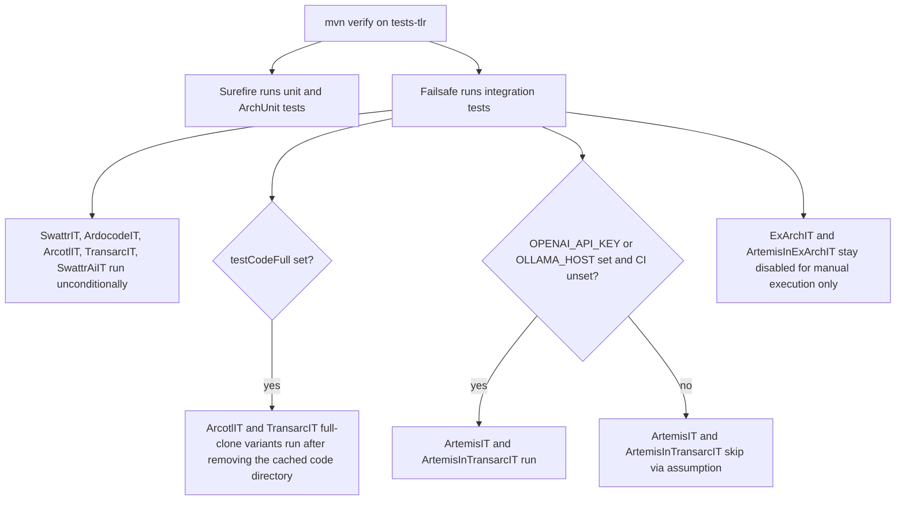
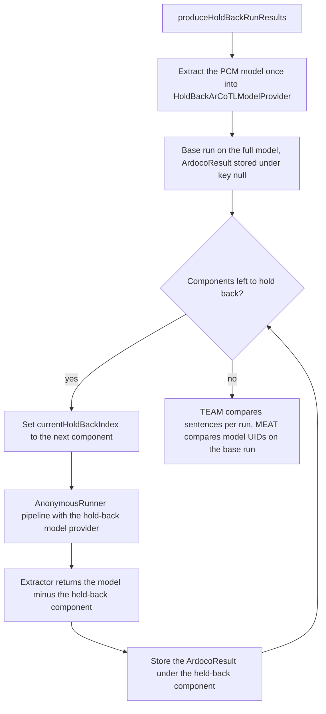

# Testing & Evaluation

ARDoCo's tests serve two purposes: they *check* the implementation (unit, architecture, and integration tests) and they *measure* it (benchmark evaluations whose precision/recall/F1/accuracy/phi results are asserted against hard-coded minimums). This page maps the infrastructure; the enforced layering itself is described in [Architecture](architecture.md), the approach pipelines in [TLR Approaches](tlr-approaches.md), the detection logic in [Inconsistency Detection](inconsistency-detection.md), and build/CI/environment details in [Operations](operations.md).

## Where the Tests Live

| Module | Path | What it provides |
|--------|------|------------------|
| `tests-base` | [`core/tests-base`](../core/tests-base/pom.xml) | Shared ArchUnit rule suites, `ConfigurationTestBase`, `ExpectedResults`, `EvaluationProject`, `EvaluationHelper`, and the bundled benchmark snapshot under `src/main/resources/benchmark` plus filter configs under `src/main/resources/configurations` |
| `tests-tlr` | [`tlr/tests-tlr`](../tlr/tests-tlr/pom.xml) | TLR integration/evaluation tests (`*IT.java`) for all approaches, plus module-local subclasses of the shared ArchUnit suites |
| `tests-inconsistency` | [`inconsistency-detection/tests-inconsistency`](../inconsistency-detection/tests-inconsistency/pom.xml) | The ID hold-back evaluation harness and baseline, plus module-local subclasses of the shared ArchUnit suites |

`tests-tlr` and `tests-inconsistency` declare `tests-base` as a **test-scoped** dependency and bind the `maven-failsafe-plugin` (root POM, version 3.5.6, goals `integration-test` + `verify` at the `integration-test` phase), so `mvn verify` runs both Surefire unit/ArchUnit tests and Failsafe integration tests.

## Shared Rule Suites in `core/tests-base`

A structural quirk that matters when editing these files: the ArchUnit suites live in **`src/main`**, not `src/test`. They compile into the regular `tests-base` jar (with compile-scoped `archunit-junit5`, `junit-jupiter-*`, `io.github.ardoco:metrics`, and `reflections` dependencies) so that every other module can consume them on its own test classpath. They are never executed in `tests-base` itself.

- **`ArchitectureTest`** — enforces the product architecture. The `layerRule` defines the layers `Common` (common/data/api/tests packages), `TextExtractor`, `ModelExtractor`, `RecommendationGenerator`, `ConnectionGenerator`, `InconsistencyDetection` (`..inconsistency..`/`..id..`), `CodeTraceability`, `Pipeline`, and `Execution`, restricting which layers may access which. Additional rules: execution classes are only used by execution and test code; classes named `Model` are only used after model extraction; classes whose simple name ends in `Link` are only used after the connection generator, and `*Link` naming is confined to the `tracelink`, `codetraceability`, and `connectiongenerator` packages; `Inconsistency`-named classes are only used after inconsistency detection.
- **`BasicArchitectureTest`** — cross-cutting rules: `@Configurable` fields may only be declared in `AbstractConfigurable` subclasses; all `TraceLink` subclasses must be `final`; `ObjectMapper` may only be constructed inside `JsonHandling`; `System.getenv` may only be called by the `Environment` utility (rule `noGetEnv`); no `forEach`/`forEachOrdered` on streams or lists ("lambdas should be functional"); and interface methods must not expose or accept JDK `List`/`Set`/`Map`/`Sorted*` raw types, preferring Eclipse Collections (outside `..metrics..`).
- **`DeterministicArdocoTest`** — keeps pipeline runs reproducible: classes that are not directly annotated `@Deterministic` must not access `Set`/`HashSet`/Eclipse `MutableSet`/`ImmutableSet`/`Sets`/`Map`/`HashMap`/`ImmutableMap`/`Maps` (excluding `..tests..`, `..metrics..`, `..magika..`); `HashMap`/`HashSet` are forbidden outright in favor of linked versions; classes annotated `@NoHashCodeEquals` must not implement `equals`/`hashCode` (empty-should allowed); classes implementing `Comparable` directly must implement both `equals` and `hashCode`; and sorted collection fields/returns may only be parameterized with `Comparable` types.
- **`ConfigurationTestBase`** — uses Reflections to find every concrete `AbstractConfigurable` subclass under `edu.kit.kastel.mcse.ardoco`, validates that all `@Configurable` fields are neither `final` nor `static`, and prints the complete default configuration in `key=value` form. It is assertion-framework agnostic (abstract `assertFalse`/`fail` hooks) so each module binds it to JUnit.
- **`ExpectedResults`** — a record of six minimum metrics (`precision`, `recall`, `f1`, `accuracy`, `phiCoefficient`, `specificity`) used by every benchmark evaluation.
- **`EvaluationHelper`** — loads classpath resources (benchmark files) into temporary files, since the extraction APIs take `File` arguments.
- **`archunit.properties`** — sets `archRule.failOnEmptyShould=false`, so a rule that matches nothing on a given module's classpath does not fail that module.

## Re-enabling the Suites per Module

The suites are plain classes with `@ArchTest` static rules; ArchUnit only runs them when a test class carrying `@AnalyzeClasses` is executed. Because the analysis classpath differs per module, `tests-tlr` and `tests-inconsistency` each re-enable the suites through tiny subclasses in their own test trees:

- `tlr/tests-tlr/.../tlr/tests/ArchitectureTest.java` and `DeterministicArdocoTest.java` extend the `core.tests.architecture` base classes and analyze `edu.kit.kastel.mcse.ardoco.core` + `edu.kit.kastel.mcse.ardoco.tlr` ("Has to be executed in this module").
- `inconsistency-detection/tests-inconsistency/.../id/tests/ArchitectureTest.java` and `DeterministicArdocoTest.java` analyze `core` + `tlr` + `id`.
- Both modules also have a `ConfigurationTest extends ConfigurationTestBase` that binds the base class to JUnit assertions.

Consequence: the same rules are effectively re-evaluated against each module's classpath, so a violation introduced in a TLR or ID module is caught even though the rule classes live in core. These subclasses run as ordinary Surefire tests during `mvn test`/`verify`.

## Benchmark Data and Evaluation Projects

All benchmark evaluation is built around the `EvaluationProject` enum in `core/tests-base`, with the five projects `MEDIASTORE`, `TEASTORE`, `TEAMMATES`, `BIGBLUEBUTTON`, and `JABREF`. Each constant carries five classpath locations: a PCM architecture model resource (`/benchmark/<p>/.../pcm/*.repository`, with UML resolved by path rewriting), the SAD text file, a GitHub code repository URL plus a **pinned commit hash**, and a cached `codeModel.acm` fixture. The benchmark snapshot under `core/tests-base/src/main/resources/benchmark` is a bundled copy of the [ardoco/benchmark](https://github.com/ardoco/benchmark) datasets.

Two access paths exist for code:

- `getCodeModelFromResources()` returns the cached ACM fixture — fast, deterministic, used by default (e.g., `ArcotlEvaluation`/`TransarcEvaluation` with `CodeConfigurationType.ACM_FILE`, and `ArdocodeEvaluation` always).
- `getCodeDirectory()` shallow-clones the GitHub repository into `$TMPDIR/ARDoCo/<PROJECT>` via `RepositoryHandler.shallowCloneRepository` (clone with depth 1, unshallow + checkout of the pinned commit if the fetched tip differs) and is only used by the `testCodeFull`-gated full-clone variants.

Per-approach task enums resolve the remaining inputs: `DocumentationToArchitectureModelTlrTask` (SAD→SAM gold standard CSVs: sentence number ↔ model element id), `ModelToCodeTlrTask` (SAM→Code CSVs: architecture id ↔ code path; entries ending in `/` are packages), `DocumentationToCodeTlrTask`, and `DocumentationToModelToCodeTlrTask`. The ID side uses `InconsistencyDetectionTask`, which wraps an `EvaluationProject` and adds the sentence-to-architecture gold standard, the `*_UME.csv` unmentioned-model-elements gold standard, a filter-list configuration (e.g., `/configurations/ms/filterlists_all.txt`), and its `ExpectedResults`.

## How Evaluation Metrics Work

All comparisons funnel through `ClassificationMetricsCalculator` from the `io.github.ardoco:metrics` library (the [ardoco/evaluator](https://github.com/ardoco/evaluator) code, pulled in by `tests-base`). A test converts results and gold standard into sorted string sets, then asks the calculator for a `SingleClassificationResult` with an explicit **confusion matrix denominator**:

- ID TEAM evaluation: the number of sentences in the text.
- SAD-SAM TLR (`SwattrEvaluation`): sentences × architecture model endpoints.
- SAD-SAM-Code TLR (`ArcotlEvaluation`, TransArC): code model endpoints × architecture model endpoints.

For code-based TLR the gold standard is *enrolled* first (`AbstractEvaluation.enrollGoldStandard`): a gold entry whose code id ends in `/` is a package and is expanded into one link per code-model endpoint under that path. Multiple per-run results are aggregated with micro/weighted/macro averages into an `AggregatedClassificationResult`.

## TLR Integration Tests (`tests-tlr`)

`AbstractArdocoIT` switches ardoco-core logging to `info` for the test class and provides `averageAndLog`, which averages repeated runs per metric and logs `mean ± stddev` — the coping mechanism for LLM nondeterminism in ArTEMiS/ExArch. The per-approach `*Evaluation` classes (in `integration/evaluation/`) build the runner, run it, compare trace links against the gold standard, log results alongside the expected minimums, and call `compareResults`.

| Test | Approach | Runs when |
|------|----------|-----------|
| `SwattrIT` | SWATTR (SAD-SAM) | always |
| `ArdocodeIT` | ARDoCode (SAD-Code, ACM fixture) | always |
| `ArcotlIT` | ArCoTL (SAM-Code, ACM fixture) | always; full-clone variant gated by `testCodeFull` |
| `TransarcIT` | TransArC (SAD-SAM-Code, ACM fixture) | always; full-clone variant gated by `testCodeFull` |
| `SwattrAiIT` | SWATTR fed pre-generated LLM component listings (`ModelFormat.COMPONENT_LISTING` from `src/test/resources/..._from_docs.txt`) | always; disables metric assertions, writes to `target/testout-tlr-it-llm` |
| `ArtemisIT` | ArTEMiS (SAD-SAM via LLM NER) | `OPENAI_API_KEY` or `OLLAMA_HOST` set **and** not on CI |
| `ArtemisInTransarcIT` | ArTEMiS NER inside TransArC | `OPENAI_API_KEY` or `OLLAMA_HOST` set **and** not on CI |
| `ExArchIT`, `ArtemisInExArchIT` | ExArch variants | `@Disabled("Only for manual execution")`, also LLM-gated and CI-skipped |



*Environment-gated selection of the TLR integration tests under Maven Failsafe.*

Details worth knowing:

- The full-clone variants (`evaluateSamCodeTlrITFull`, `evaluateSadSamCodeTlrITFull`) first call `RepositoryHandler.removeRepository` on the cached code directory so the pinned commit is genuinely re-cloned from GitHub, then evaluate with `CodeConfigurationType.DIRECTORY`.
- `ArtemisIT` parameterizes over the cross product of all non-generic `LargeLanguageModel` values × `ArtemisEvaluationProject` via a `@MethodSource`. A `@BeforeAll` assumption requires `OPENAI_API_KEY` or `OLLAMA_HOST`; because `checkLlmProvision` only accepts an OpenAI key, an Ollama-only setup passes the class-level assumption but each test logs a skip. Setting the env variable `mutipleRuns` (sic — the typo is in the code) switches from single runs to `NUMBER_OF_RUNS = 5` repeated runs aggregated by `averageAndLog`.
- The ArTEMiS evaluation project enums currently carry uniform `0.420` minimums for all metrics — deliberately loose, since LLM output is nondeterministic.
- The ExArch ITs exist mainly to produce comparison tables: `ExArchIT` collects results per project × LLM in an `@AfterAll` and prints a LaTeX-style P/R/F1 row per LLM with macro and weighted averages.

## ID Hold-Back Evaluation Harness (`tests-inconsistency`)

`InconsistencyDetectionEvaluationIT` (ordered via `@TestMethodOrder(MethodOrderer.OrderAnnotation.class)`) evaluates TEAM and MEAT inconsistency detection on the `InconsistencyDetectionTask` projects. Its javadoc also documents the **EnumSource names trick**: to run a single project, temporarily change `@EnumSource(InconsistencyDetectionTask.class)` to `@EnumSource(value = InconsistencyDetectionTask.class, names = { "BIGBLUEBUTTON" })` — and revert before committing.



*Hold-back run structure: one base run plus one run per architecture component, each removing exactly one component.*

- **Run production (`HoldBackRunResultsProducer`)**: the first run uses the full model and is stored under the `null` key; each subsequent run removes exactly one component (`HoldBackArCoTLModelProvider` supplies a `PipelineAgent` whose extractor returns the initial model minus the current hold-back; a negative index holds nothing back). Every run is an `AnonymousRunner` pipeline `TextPreprocessingAgent → TextExtraction → hold-back model provider → RecommendationGenerator → ConnectionGenerator → InconsistencyChecker` (or `InconsistencyBaseline` for the baseline variant), configured from the project's filter-list file.
- **TEAM evaluation (order 1)**: for every held-back run, the test collects the sentence numbers of the detected `TextEntityAbsentFromModelInconsistency` entries and compares them with the gold-standard sentences that mention the removed element (`getGoldstandardForArchitectureModel`). Per-run results are aggregated with the **micro-average** and asserted against the project's `ExpectedResults` minimums by `checkResults` — dropping below a minimum fails the build. Base runs (`null` key) are excluded from scoring but their inconsistency count is logged.
- **Baseline (order 5, env-gated)**: enabled only when the environment variable `testBaseline` is set to any value. It swaps `InconsistencyChecker` for `InconsistencyBaseline`, whose informant flags *every sentence without a trace link* as a TEAM inconsistency with fixed confidence `0.69` — a trivial upper-bound comparison point. Its **weighted-average** metrics are logged, never asserted.
- **MEAT evaluation (order 10)**: reuses the base run's `ArdocoResult` (cached in a static `EnumMap` by the TEAM test; recomputed if missing) and compares the UIDs of all reported `ModelInconsistency` instances against the ids listed in the project's `*_UME.csv` gold standard (header and blank lines stripped). Explicit TP/FP/FN counts are logged; no minimum assertions here.
- **Outputs**: everything lands under `target/testout` — `ardoco_eval_id/inconsistencies_<PROJECT>.txt` and `detailed_inconsistencies_<PROJECT>.txt` (per hold-back run: removed instance, metrics, TP/FP/FN lists), `ardoco_eval_id/inconsistentModelElements_<PROJECT>.txt` (MEAT), plus `traceLinks_<PROJECT>.txt` and `inconsistencyDetection_<PROJECT>.txt` for the base run. TLR ITs write their runner outputs to `target/<project>-output`.

The detection logic these tests exercise is described in [Inconsistency Detection](inconsistency-detection.md).

## Running the Tests

All commands work from the repository root (the root POM aggregates `core`, `tlr`, and `inconsistency-detection`); `.mvn/maven.config` already enables parallel builds and tests (see [Operations](operations.md)).

```bash
# Everything: unit + ArchUnit + integration tests (gated ones skip without env)
mvn clean verify

# TLR tree only (tests-tlr ITs included)
mvn -pl tlr clean verify

# ID tree only (tests-inconsistency ITs included)
mvn -pl inconsistency-detection clean verify

# A single TLR IT class (Failsafe's it.test selector)
mvn -pl tlr clean verify -Dit.test=ArcotlIT -DfailIfNoSpecifiedTests=false

# Single ID project: edit @EnumSource(..., names = { "BIGBLUEBUTTON" }) in
# InconsistencyDetectionEvaluationIT, then run; revert before committing
mvn -pl inconsistency-detection clean verify

# Full-clone code variants for ArCoTL/TransArC (clones from GitHub at the pinned commit)
testCodeFull=1 mvn -pl tlr clean verify

# ID baseline (logs only, never asserts)
testBaseline=1 mvn -pl inconsistency-detection clean verify

# LLM-gated ArTEMiS ITs locally (never on CI)
OPENAI_API_KEY=... mvn -pl tlr clean verify

# Quick architecture-rule check for one module
mvn -pl tlr test -Dtest='ArchitectureTest,DeterministicArdocoTest,ConfigurationTest'
```

Only the `testCodeFull` full-clone variants of the ArCoTL/TransArC evaluations need network access — they clone from GitHub at the pinned commit on first execution and cache the result under `$TMPDIR/ARDoCo/<PROJECT>`; all other evaluations run purely from bundled resources.

## Keeping Test Trees in Sync

The `tlr/tests-tlr` test tree is synced from the separate [ardoco/IntegrationTests](https://github.com/ardoco/IntegrationTests) repository via [`tlr/update_integration_tests.sh`](../tlr/update_integration_tests.sh), which adds the `integrationTests` remote, fetches `main`, and runs `git subtree pull --prefix tests/integration-tests integrationTests main --squash` (note the prefix as written; the script ends with an interactive pause).

## The `ExpectedResults` Invariant

Every benchmark minimum lives as a literal in a test-side enum (`SwattrEvaluationProject`, `ArcotlEvaluationProject`, `ArtemisEvaluationProject`, `InconsistencyDetectionTask`, …) and is asserted with `assertTrue(metric >= minimum)` inside `Assertions.assertAll`, so a regression in **any** single metric fails the build. The assertions cover precision, recall, F1, accuracy, and the phi coefficient; specificity is carried and logged but not currently asserted. This creates the invariant for contributors:

> **Any change that shifts evaluation metrics — heuristics, filters, thresholds, pipeline composition, model extraction — requires a deliberate, justified update to the affected `ExpectedResults` constants.** Silently lowering a minimum to make the build pass is a correctness failure, not a fix; improvements should instead raise the minimums so regressions stay visible.

This is also why the determinism rules (`DeterministicArdocoTest`) exist: with unordered collections or `HashMap`-keyed iteration, evaluation metrics could drift between runs and trip exactly these assertions.

## Pointers

- Changing pipeline stages or the DataRepository? See [Architecture](architecture.md) — the ArchUnit rules described above enforce those invariants at build time.
- Understanding *why* a TLR evaluation score moved? Start with the approach pipeline in [TLR Approaches](tlr-approaches.md).
- Understanding TEAM/MEAT detection behavior and the filter funnel? See [Inconsistency Detection](inconsistency-detection.md).
- Build prerequisites, CI workflows, and general environment variables: [Operations](operations.md) and [Quickstart](quickstart.md).
