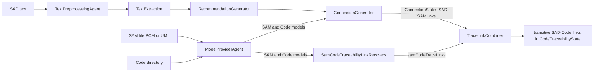

# TLR Approaches

ARDoCo provides multiple Traceability Link Recovery (TLR) approaches that connect different types of software artifacts. This page documents each approach, its exact runner pipeline composition, the underlying stage modules, the model/code extraction backends, the LLM-based variants, and the ArCoTL heuristic computation tree.

## Artifact Types

| Abbreviation | Meaning |
|--------------|---------|
| **SAD** | Software Architecture Documentation (natural language text) |
| **SAM** | Software Architecture Model (formal model: PCM, UML, component listing) |
| **Code** | Source code (Java and Shell are actively extracted; ANTLR support for Java, Python 3, and C++ exists) |

## Approach Overview

| Approach | Runner | Artifacts | Description |
|----------|--------|-----------|-------------|
| **SWATTR** | `Swattr` | SAD ↔ SAM | Agent-based NLP pipeline linking documentation to architecture models |
| **ArDoCode** | `Ardocode` | SAD ↔ Code | Treats code as the model; matches documentation directly to code elements |
| **ArCoTL** | `Arcotl` | SAM ↔ Code | Heuristic computation tree matching architecture model to code |
| **TransArC** | `Transarc` | SAD → SAM → Code | SWATTR (SAD→SAM) + ArCoTL (SAM→Code) + transitive combination |
| **ExArch** | `ExArch` | SAD ↔ Code | LLM generates a component-only SAM from SAD (and optionally code), then ArCoTL-style SAM→Code |
| **ArTEMiS** | `Artemis` | SAD ↔ SAM | LLM-based named entity recognition matches SAD entities to model endpoints |
| **ArTEMiS in ExArch** | `ArtemisInExArch` | SAD ↔ Code | LLM-generated SAM + ArTEMiS NER matching + ArCoTL SAM→Code |
| **ArTEMiS in TransArC** | `ArtemisInTransArC` | SAD ↔ Code | Manual SAM + ArTEMiS NER matching + ArCoTL SAM→Code |

All eight runners live in `tlr/pipeline-tlr/src/main/java/edu/kit/kastel/mcse/ardoco/tlr/execution/`: `Swattr.java`, `Ardocode.java`, `Arcotl.java`, `Transarc.java`, `ExArch.java`, `Artemis.java`, `ArtemisInExArch.java`, `ArtemisInTransArC.java`.

## Runner Contract and Metamodel Pinning

Every approach is implemented as a runner class extending `ArdocoRunner`. Its public `setUp(...)` method validates inputs, calls the private `definePipeline(...)`, marks the runner as set up, and registers the output directory. Two invariants hold for all runners:

- **Metamodel guard**: `setUp` throws `IllegalArgumentException("Metamodel shall not be set in configurations. The runner defines the metamodels.")` when the passed `ArchitectureConfiguration`/`CodeConfiguration` already carries a metamodel. Each runner then pins the metamodel itself via `withMetamodel(...)` before constructing the `ModelProviderAgent`. The four possible values come from the `Metamodel` enum (`core/framework/common/.../api/models/Metamodel.java`): `CODE_WITH_COMPILATION_UNITS`, `ARCHITECTURE_WITH_COMPONENTS_AND_INTERFACES`, `CODE_WITH_COMPILATION_UNITS_AND_PACKAGES`, `ARCHITECTURE_WITH_COMPONENTS`.
- **Text ingestion**: every text-based runner reads the input file up front with `CommonUtilities.readInputText`, rejects blank text with `IllegalArgumentException("Cannot deal with empty input text. Maybe there was an error reading the file.")`, and stores it via `DataRepositoryHelper.putInputText`. Only `Arcotl` skips this (it has no text input).

Metamodels pinned per runner (derived from the current `definePipeline()` bodies):

| Runner | Architecture metamodel | Code metamodel |
|--------|------------------------|----------------|
| `Swattr` | `ARCHITECTURE_WITH_COMPONENTS` | — |
| `Ardocode` | — | `CODE_WITH_COMPILATION_UNITS_AND_PACKAGES` |
| `Arcotl` | `ARCHITECTURE_WITH_COMPONENTS_AND_INTERFACES` | `CODE_WITH_COMPILATION_UNITS` |
| `Transarc` | `ARCHITECTURE_WITH_COMPONENTS` | `CODE_WITH_COMPILATION_UNITS` |
| `ExArch` | — (LLM agent adds the SAM) | `CODE_WITH_COMPILATION_UNITS` |
| `Artemis` | `ARCHITECTURE_WITH_COMPONENTS` | — |
| `ArtemisInExArch` | — (LLM agent adds the SAM) | `CODE_WITH_COMPILATION_UNITS` |
| `ArtemisInTransArC` | `ARCHITECTURE_WITH_COMPONENTS` | `CODE_WITH_COMPILATION_UNITS` |

## Pipeline Compositions

The compositions below are transcribed directly from each runner's `definePipeline()` method.

**SWATTR** (`Swattr.java`):
```
TextPreprocessingAgent
→ ModelProviderAgent (architecture only)
→ TextExtraction
→ RecommendationGenerator
→ ConnectionGenerator
```

**ArDoCode** (`Ardocode.java`) — note that the model provider runs *before* text preprocessing, and the pipeline appends the SAD→Code stage:
```
ModelProviderAgent (code only, CODE_WITH_COMPILATION_UNITS_AND_PACKAGES)
→ TextPreprocessingAgent
→ TextExtraction
→ RecommendationGenerator
→ ConnectionGenerator
→ SadCodeTraceabilityLinkRecovery
```

**ArCoTL** (`Arcotl.java`) — no text at all:
```
ModelProviderAgent (architecture + code)
→ SamCodeTraceabilityLinkRecovery
```

**TransArC** (`Transarc.java`):
```
TextPreprocessingAgent
→ ModelProviderAgent (architecture + code)
→ TextExtraction
→ RecommendationGenerator
→ ConnectionGenerator
→ SamCodeTraceabilityLinkRecovery
→ SadSamCodeTraceabilityLinkRecovery
```

**ExArch** (`ExArch.java`) — inserts the LLM architecture provider after the code model provider; `setUp` additionally takes a `LargeLanguageModel`, a documentation extraction prompt, an optional code extraction prompt with `LlmArchitecturePrompt.Features`, and an optional aggregation prompt:
```
TextPreprocessingAgent
→ ModelProviderAgent (code only, CODE_WITH_COMPILATION_UNITS)
→ LlmArchitectureProviderAgent
→ TextExtraction
→ RecommendationGenerator
→ ConnectionGenerator
→ SamCodeTraceabilityLinkRecovery
→ SadSamCodeTraceabilityLinkRecovery
```

**ArTEMiS** (`Artemis.java`) — uses the lightweight `SimpleTextPreprocessingAgent` (no CoreNLP) and replaces the SWATTR text stages with the NER connection generator, which takes its own `LargeLanguageModel` for NER:
```
SimpleTextPreprocessingAgent
→ ModelProviderAgent (architecture only)
→ NerConnectionGenerator
```

**ArTEMiS in ExArch** (`ArtemisInExArch.java`) — ExArch's LLM-generated SAM, but the SAD–SAM linking step is ArTEMiS NER matching instead of the SWATTR text pipeline:
```
SimpleTextPreprocessingAgent
→ ModelProviderAgent (code only, CODE_WITH_COMPILATION_UNITS)
→ LlmArchitectureProviderAgent
→ NerConnectionGenerator
→ SamCodeTraceabilityLinkRecovery
→ SadSamCodeTraceabilityLinkRecovery
```

**ArTEMiS in TransArC** (`ArtemisInTransArC.java`) — TransArC with a manual SAM, but SAD–SAM linking via ArTEMiS NER:
```
SimpleTextPreprocessingAgent
→ ModelProviderAgent (architecture + code)
→ NerConnectionGenerator
→ SamCodeTraceabilityLinkRecovery
→ SadSamCodeTraceabilityLinkRecovery
```

### TransArC Artifact Flow



*TransArC artifact flow: SWATTR-style SAD–SAM links from the ConnectionGenerator and ArCoTL SAM–Code links are joined by the TraceLinkCombiner — the informant inside SadSamCodeTraceabilityLinkRecovery — into transitive SAD→Code links. The ArTEMiS hybrids swap the ConnectionGenerator for the NerConnectionGenerator.*

## Stage Modules

`tlr/stages-tlr/` is a Maven aggregator with seven modules (`code-traceability`, `connection-generator`, `connection-generator-ner`, `model-provider`, `recommendation-generator`, `text-extraction`, `text-preprocessing`). The `model-provider` and `text-preprocessing` modules provide `PipelineAgent`s that runners wire directly; the other five provide `AbstractExecutionStage` stages. Stages communicate only through the shared `DataRepository` (see [Architecture](architecture.md)).

### 1. Text Preprocessing (`text-preprocessing/`)

- **`TextPreprocessingAgent`** wraps `CoreNLPProvider`, which produces a fully annotated `Text` (tokenization, POS tags, dependency parsing, lemmatization) via Stanford CoreNLP. Used by SWATTR, ArDoCode, ArCoTL (n/a), TransArC, and ExArch.
- **`SimpleTextPreprocessingAgent`** wraps `SimpleTextProvider`, which stores the raw input string as a `SimpleText`/`SimplePreprocessingData` without any NLP annotation. Used by ArTEMiS, ArTEMiS in ExArch, and ArTEMiS in TransArC — `NerInformant` reads exactly this simple text and works on raw lines.
- **CoreNLP microservice fallback chain** (`textprocessor/TextProcessor`): if `nlpProviderSource` equals `"microservice"` *and* `MicroserviceChecker` confirms health (a GET to `<microserviceUrl>/stanfordnlp/health` must answer exactly `"Microservice is healthy"`), the text is processed by the microservice. `IOException`s are retried up to `MAX_FAILED_SERVICE_REQUESTS = 2` times; `NotConvertableException`/`InvalidJsonException` (conversion errors) fall back to local processing immediately; after two failed attempts processing continues locally. All requests use HTTP basic auth from the `SCNLP_SERVICE_USER`/`SCNLP_SERVICE_PASSWORD` environment variables. `ConfigManager` (singleton) loads `config.properties` (defaults: `microserviceUrl=http://localhost:8080`, `nlpProviderSource=local`) and lets the `MICROSERVICE_URL` and `NLP_PROVIDER_SOURCE` environment variables override the file values.

### 2. Text Extraction (`text-extraction/`)

Stage `TextExtraction` wires two agents: `InitialTextAgent` (informants `NounInformant`, `InDepArcsInformant`, `OutDepArcsInformant`, `SeparatedNamesInformant`) and `PhraseAgent` (`CompoundAgentInformant`). A third agent, `MappingCombiner` (`MappingCombinerInformant`), exists in the module but is not added by the stage's constructor. Output: a `TextState` with `NounMapping`s and `PhraseMapping`s.

### 3. Model Provider (`model-provider/`)

- **`ModelProviderAgent`** requires at least one of the two configurations (otherwise `IllegalArgumentException`). For `ArchitectureConfiguration` it creates a `ModelProviderInformant` with the extractor selected by `ModelFormat`: `PCM` → `PcmExtractor`, `UML` → `UmlExtractor`, `COMPONENT_LISTING` → `ComponentListingArchitectureExtractor` (`ACM` is rejected). For `CodeConfiguration` there are two modes (`CodeConfigurationType`): `DIRECTORY` extracts from a code folder via `AllLanguagesExtractor`; `ACM_FILE` reads a previously persisted code model file instead of parsing code.
- **`LlmArchitectureProviderAgent`** wraps `LlmArchitectureProviderInformant` (see [LLM Integration](#llm-integration)) and adds an LLM-generated architecture model to `ModelStates`.

**Code extraction backends — what is actually active**: `AllLanguagesExtractor` is the only code-extractor factory used in pipelines (it is what `CodeConfiguration.extractors()` returns in `DIRECTORY` mode). It currently wires exactly two extractors:

- `ProgrammingLanguage.JAVA` → the Eclipse-JDT-based `JavaExtractor` (`.../generators/code/java/`), which parses each `.java` file into a JDT `CompilationUnit` and builds the model in `JavaModel`.
- `ProgrammingLanguage.SHELL` → `ShellExtractor`/`ShellVisitor`, which walks the file tree (file types detected via the `FileTypePredictor`) and produces compilation units with empty import lists and no `ControlElement`s.

The result model type follows the pinned metamodel: `CODE_WITH_COMPILATION_UNITS_AND_PACKAGES` → `CodeModelWithCompilationUnitsAndPackages`, `CODE_WITH_COMPILATION_UNITS` → `CodeModelWithCompilationUnits`, anything else → `IllegalStateException`.

**Imports, callees, and line ranges in the code model**: `CodeCompilationUnit.importedModuleNames`, `CodeAssembly.importedModuleNames`, `ControlElement.calleeNames`, and the 1-indexed `startLine`/`endLine` fields on datatypes and control elements are the cross-element relationship fields (see [Architecture — Module imports and function callees](architecture.md#module-imports-and-function-callees)). In the active JDT path, `JavaModel.extractImportedModuleNames` fills imports from `ImportDeclaration` fully-qualified names, an `ASTVisitor` collects `MethodInvocation` and `ClassInstanceCreation` names into `calleeNames`, and `compilationUnit.getLineNumber(...)` supplies the line ranges for `ClassUnit`/`InterfaceUnit`/`ControlElement`. Packages are derived from `PackageDeclaration`s and merged by name. The behavior is pinned by `JavaExtractorTest` (fixture `AClassWithCalls.java`: `caller` must list `helper`, `TestClass`, `method` as callees; `AClass` must import `edu.zwei.OtherInterface`) and `Python3ControlExtractorTest` (fixture `APyModuleWithCalls.py`).

**ANTLR mapping packages — present but not wired**: full ANTLR4 extraction/mapping stacks exist for `java`, `python3`, and `cpp` under `.../generators/antlr/` (grammars generated by the `antlr4-maven-plugin` into `.../models/antlr4/{java,python3,cpp}`). `AntlrExtractor` (base of `antlr.extraction.{java,python3,cpp}.Extractor`s) currently hard-pins `Metamodel.CODE_WITH_COMPILATION_UNITS` (with a TODO for other metamodels). Their `Element` model carries `startLine`/`endLine`, `comment`, `calleeNames`, and `imports`; the per-language mappers pass them into the `ClassUnit`/`InterfaceUnit`/`CodeCompilationUnit` constructors (`CompilationUnitMapper`), `CodeAssembly` (`FileMapper`, C++), and `ControlElement` (`FunctionMapper`, all three languages). However, **none of these ANTLR extractors is referenced by `AllLanguagesExtractor` or any other main-source pipeline** — they are exercised only by unit tests (`JavaModelMapperTest`, `Python3ModelMapperTest`, `CppExtractorTest`, etc.). Activating a new language means adding it to the `AllLanguagesExtractor` map.

**Model persistence**: after extraction, `ModelProviderInformant` stores the model in `ModelStates` and — for code models — writes it out next to the code as `codeModel.acm` via `CodeExtractor.writeOutCodeModel` (Jackson DTO). `CodeExtractor.readInCodeModel` reconstructs the matching `CodeModel` subclass by metamodel; this is the read path used by `ACM_FILE` code configurations, giving an end-to-end cache: extract once, reuse the `.acm` file in later runs.

**Architecture model serialization**: `ArchitectureExtractor.writeOutArchitectureModel(model, file)` can serialize an `ArchitectureModel` to the conventional `architectureModel.aam` via `ArchitectureModel.createArchitectureModelDto()`. This is a write-only export API: no code path in the repository reads an `.aam` back into an `ArchitectureModel`, and no shipped pipeline invokes the writer, so architecture models are currently always re-extracted per run.

### 4. Recommendation Generator (`recommendation-generator/`)

Stage `RecommendationGenerator` wires `InitialRecommendationAgent` (`NameTypeInformant`) and `PhraseRecommendationAgent` (`CompoundRecommendationInformant`). It builds a per-metamodel `RecommendationState` from `ModelStates` and produces `RecommendedInstance`s from text and model data.

### 5. Connection Generator (`connection-generator/`)

Stage `ConnectionGenerator` wires, in order, `InitialConnectionAgent` (`NameTypeConnectionInformant`, `ExtractionDependentOccurrenceInformant`), `ReferenceAgent` (`ReferenceInformant`), `ProjectNameFilterAgent` (`ProjectNameInformant`, demotes recommended instances containing the project name), and `InstanceConnectionAgent` (`InstantConnectionInformant`). It creates per-metamodel `ConnectionStates` holding trace links between `RecommendedInstance`s and model elements — this is the SWATTR SAD→SAM (or SAD→Code, for ArDoCode) link source.

### 6. Connection Generator NER (`connection-generator-ner/`)

Stage `NerConnectionGenerator` wires `NerAgent` (`NerInformant`) and `NerConnectionAgent` (`NerConnectionInformant`). Its `initializeState()` reads the metamodels present in `ModelStates` (`orElseThrow`, so a `ModelProviderAgent` must have run first) and builds `NerConnectionStatesImpl`. Output: per-metamodel `NerConnectionState` with `NamedArchitectureEntity` occurrences matched to model endpoints (details in [LLM Integration](#llm-integration)).

### 7. Code Traceability (`code-traceability/`)

Three stages, each with a single agent:

- **`SamCodeTraceabilityLinkRecovery`** → `InitialCodeTraceabilityAgent` → `ArCoTLInformant`: computes SAM↔Code links with the ArCoTL computation tree (below) and stores them in `CodeTraceabilityState` as `samCodeTraceLinks`. The informant collects exactly one architecture and one code model from `ModelStates` (duplicates throw `IllegalStateException`) and delegates to `TraceLinkGenerator`.
- **`SadCodeTraceabilityLinkRecovery`** → `ArchitectureLinkToCodeLinkTransformerAgent` → `ArchitectureLinkToCodeLinkTransformerInformant`: the ArDoCode stage. It reads the SWATTR `ConnectionStates` for `CODE_WITH_COMPILATION_UNITS_AND_PACKAGES`, remaps each linked code element to compilation units (a linked `CodePackage` expands to every compilation unit whose path contains the package path; anything else is resolved by id), and stores the resulting SAD→Code links.
- **`SadSamCodeTraceabilityLinkRecovery`** → `TransitiveTraceabilityAgent` → `TraceLinkCombiner`: the transitive combination stage (below).

## ArCoTL Heuristic Computation Tree

`ArCoTLInformant` delegates to `TraceLinkGenerator` (`tlr/stages-tlr/code-traceability/.../informants/arcotl/TraceLinkGenerator.java`), which builds a static computation tree of heuristic nodes. The tree, exactly as coded in the static initializer (and identically rebuilt by the `getRoot(PreprocessingMethod)` variant):

```
root = Filter(
    Maximum(
        pathBest      = MatchBest.code(MatchBest.arch(PathResemblance)),
        compFiltered  = Filter(
            commonWords = Maximum(
                ComponentNameResemblanceTest(compCombined),
                compCombined
            ),
            Required(commonWords)
        ),
        interfaceBest = MatchBest.code(MatchBest.arch(
            Maximum(
                interfaceName   = ComponentNameResemblance(INTERFACE, NONE),
                interfaceMethod = MethodResemblance
            )
        ))
    ),
    ProvidedInterfaceCorrespondence(maxCompInterface)
)

with the component branch:
    compCombined = Maximum(
        MatchSequentially.arch(packageFiltered, compNameInherited),
        ComponentNameResemblance(COMPONENT_WITHOUT_PACKAGE, NONE)
    )
    compNameInherited = Maximum(InheritLinks(compNameBest), compNameBest)
    compNameBest      = MatchBest.code(ComponentNameResemblance(COMPONENT, NONE))
    packageFiltered   = Filter(packageBest, SubpackageFilter(packageBest))
    packageBest       = MatchBest.code(MatchBest.arch(PackageResemblance(STEMMING)))
```

Reading of the plumbing, node by node:

- **`ComponentNameResemblanceTest` ("commonWords")** is a *dependent* heuristic layered on `compCombined`: it re-matches names after removing generic common words — `{Test, Action, Impl, Factory, Exception}` minus any word that appears in an architecture endpoint name — and can extend an existing component's confidence to linked compilation units in the same package. Its result is united with `compCombined` via `Maximum` before the `Required` filter.
- **`InheritLinks`** unions inherited-name matches with the direct component-name matches (`compNameInherited = Maximum(InheritLinks(compNameBest), compNameBest)`).
- **`MatchSequentially`** combines the package-stemming branch with the component-name branch (`packageAndName`), keeping only the links of the first child that produced a link for an endpoint — the package-based links win, and the component-name branch applies only where the package branch linked nothing.
- **`SubpackageFilter` ("subpackageRemoval")** filters the `PackageResemblance` matches: it flags a link for removal when another architecture endpoint linked to the same compilation unit matches a parent package of it.
- **`Required` ("compLinks")** flags a component's link to a compilation unit for removal when the unit is linked to multiple components and the component requires an interface provided by another one of those linked components — the unit is attributed to the required (provider) component, and the requiring component's link is dropped.
- **`ProvidedInterfaceCorrespondence` ("interfaceProvision")**, the root filter, removes a component's link to a compilation unit when a provided interface of the component is realized (via extended/implemented types) in a different package among the component's other linked packages, but not in the linked unit's own package.

`Filter` semantics (used at `subpackageRemoval`, `compLinks`, and the root): the first child produces the candidate links and each subsequent child marks tuples whose confidence is cleared. Per architecture endpoint, if filtering would remove every link, the unfiltered candidate result is returned instead — the filters refine rather than veto.

The named nodes and their config labels (`treeConfigs`): `interfaceName`, `interfaceMethod`, `interfaceBest`, `packageStemming`, `packageBest`, `subpackageRemoval`, `compName`, `compNameBest`, `hintInheritance`, `packageAndName`, `commonWords`, `compLinks`, `path`, `pathBest`, `combination` (the `Maximum` over path/component/interface branches), `interfaceProvision` (the root).

Heuristic class inventory: standalone heuristics (`StandaloneHeuristic`) are `ComponentNameResemblance`, `PackageResemblance`, `MethodResemblance`, `PathResemblance`; dependent heuristics (`DependentHeuristic`) are `ComponentNameResemblanceTest`, `InheritLinks`, `SubpackageFilter` (plus the unused `SubpackageFilter2`), `Required`, `ProvidedInterfaceCorrespondence`; aggregation functions are `Maximum`, `MatchBest`, `MatchSequentially`, `Filter` (`Average` and `Threshold` exist but are not part of the tree). `Computation` evaluates the tree against `(ArchitectureModel, CodeModel)`; every endpoint tuple carrying a confidence value at the root becomes an `ArchitectureCodeTraceLink`.

## Transitive Link Combination

`TraceLinkCombiner` (`tlr/stages-tlr/code-traceability/.../informants/TraceLinkCombiner.java`) is the sole informant of `SadSamCodeTraceabilityLinkRecovery`:

1. It reads `CodeTraceabilityState.getSamCodeTraceLinks()` (from ArCoTL) and the SAD–SAM links from whichever connection state exists: the SWATTR `ConnectionStates` (metamodel `ARCHITECTURE_WITH_COMPONENTS`) or, if absent, the ArTEMiS `NerConnectionStates`. If neither exists (or no code traceability state), it returns without producing anything.
2. For the ArTEMiS source it converts NER links to sentence-based links: NER occurrence lines are 1-based, so the sentence number is decremented (`getSentenceNumber() - 1`) to obtain the 0-based sentence index used everywhere else.
3. `combineToTransitiveTraceLinks` joins a SAD–SAM link with a SAM–Code link whenever the SAM element id matches (`sadSamTraceLink.getSecondEndpoint().getId()` equals `samCodeTraceLink.getFirstEndpoint().getId()`), producing a `TransitiveTraceLink`.
4. The combined links are added to `CodeTraceabilityState` as `sadCodeTraceLinks` — the SAD→Code result consumed by `ArdocoResult`.

## LLM Integration

The LLM-based approaches (ExArch, ArTEMiS, and the hybrids) share the following machinery in `tlr/stages-tlr/model-provider/` and `connection-generator-ner/`.

### `LargeLanguageModel` enum

`LargeLanguageModel` (model-provider informants) enumerates the selectable models: `GPT_4_O` (`gpt-4o-2024-08-06`, temperature 0.0), `GPT_4_1` (`gpt-4.1-2025-04-14`, temperature 0.0), `GPT_5` (`gpt-5-2025-08-07`, temperature 1.0), `OPENAI_GENERIC` (model name from `OPENAI_MODEL_NAME`), and `OLLAMA_GENERIC` (model name from `OLLAMA_MODEL_NAME`); the `*_GENERIC` constants are recognized via `isGeneric()`. OpenAI models require `OPENAI_ORGANIZATION_ID` and `OPENAI_API_KEY` (10-minute timeout, fixed `seed` for reproducibility — from `SEED`, default `422413373`); Ollama models use `OLLAMA_HOST` with either `OLLAMA_USER`/`OLLAMA_PASSWORD` basic auth or an `OLLAMA_TOKEN` on an OpenAI-compatible endpoint (15/30-minute timeouts, temperature 0.0). `create()` wraps the underlying `ChatModel` in a `CachedChatLanguageModel`; `createUncached()` bypasses the cache.

### `CachedChatLanguageModel` JSON cache

`CachedChatLanguageModel` persists every chat exchange as JSON in `LLM_CACHE_DIR` (environment variable; default `.cache-llm/`), one file per enum constant (`<CACHE_KEY>-cache.json`). The cache key is the `toString()` of the message list with line endings normalized, so identical prompts are answered from the file without network calls; on a miss the response is written back immediately. The ObjectMapper uses relaxed stream constraints (`maxNameLength=100000`). ExArch's `LlmArchitectureProviderInformant` and the cached path therefore make repeated runs deterministic in cost, while ArTEMiS's `NerInformant` deliberately calls `createUncached()`.

### ExArch: `LlmArchitecturePrompt` and `LlmArchitectureProviderInformant`

`LlmArchitecturePrompt` provides three multi-turn prompt templates: `EXTRACT_FROM_ARCHITECTURE` (elaborate the SAD, then list component names in `- Name1` format), `EXTRACT_FROM_CODE` (parameterized by a `Features` placeholder — `PACKAGES` or `PACKAGES_AND_THEIR_CLASSES`), and `AGGREGATION` (deduplicate a merged list). `LlmArchitectureProviderInformant`:

- validates at construction that `OPENAI_API_KEY`/`OPENAI_ORGANIZATION_ID` are set for OpenAI models, that at least one prompt is given, and that a code prompt always carries a code feature;
- extracts component names from the documentation (the stored input text) and/or from the code model, then aggregates them either via the LLM aggregation prompt or, without one, by merging the two lists with a Levenshtein similarity check (0.5 threshold);
- normalizes names (strip `Component`/`Components`, camel-case, distinct, sorted) and builds a component-only architecture model: one `ArchitectureComponent` per name inside an `ArchitectureModelWithComponentsAndInterfaces`, wrapped in an `ArchitectureComponentModel` and added to `ModelStates`;
- when the code prompt is used, resolves packages from the `CODE_WITH_COMPILATION_UNITS_AND_PACKAGES` model in `ModelStates`. The shipped ExArch/ArTEMiS-in-ExArch runners only provide `CODE_WITH_COMPILATION_UNITS`, so with those runners the code-based extraction logs `"Code model not found"` and contributes nothing — the evaluation tests (`ExArchIT`, `ArtemisInExArchIT`) accordingly pass `codePrompt = null`.

### ArTEMiS: NAER-based NER and matching

`NerConnectionGenerator` depends on `io.github.ardoco:named-architecture-entity-recognition:2.0.0` (NAER, declared in `connection-generator-ner/pom.xml`). `NerInformant` builds a `SoftwareArchitectureDocumentation` from the simple text, creates an uncached chat model from the runner's `LargeLanguageModel`, and runs NAER's `NamedEntityRecognizer` with a two-part prompt (`TwoPartPrompt`: a detailed component-identification task prompt plus a JSON formatting prompt). Candidate model endpoint names from the architecture model (component vs. interface, by type string) scope the recognition; NAER results are sorted by name to keep the output order deterministic, although the informant is annotated `@Deterministic("Currently not fully deterministic due to NAER.")`. The recognized `NamedArchitectureEntity`s (name, alternative names, 1-based occurrence lines) are stored in the per-metamodel `NerConnectionState`.

`NerConnectionInformant` matches each NAE against model endpoints in three escalating phases: (1) strong word similarity on name and alternative names via `SimilarityUtils`; (2) weak similarity on name parts (whitespace/camel-case splits); (3) embedding similarity using OpenAI `text-embedding-3-large` with cosine similarity ≥ `0.6` (`EMBEDDING_SIMILARITY_THRESHOLD`) — this phase requires `OPENAI_API_KEY` and throws otherwise. Each occurrence of a matched NAE becomes a trace link with `DEFAULT_PROBABILITY = 0.92`; unmatched NAEs are recorded as `unlinkedNamedArchitectureEntities`.

## Testing

Integration tests live in `tlr/tests-tlr/src/test/java/.../tests/integration/` and evaluate precision/recall/F1 (plus accuracy, specificity, phi) against benchmark gold standards:

- **Run in CI**: `SwattrIT`, `ArdocodeIT`, `ArcotlIT`, `TransarcIT` parameterize over their benchmark projects (`EnumSource`); `ArcotlIT`/`TransarcIT` additionally offer a full-clone variant gated by `testCodeFull`. `SwattrAiIT` feeds pre-generated LLM component listings (`ModelFormat.COMPONENT_LISTING`) into plain SWATTR.
- **LLM-gated**: `ArtemisIT` and `ArtemisInTransarcIT` assume `OPENAI_API_KEY` or `OLLAMA_HOST` is set and skip on CI (`Assumptions.assumeTrue`), parameterized over all non-generic `LargeLanguageModel` values; `ExArchIT` and `ArtemisInExArchIT` are `@Disabled("Only for manual execution")` and additionally skip on CI. `AbstractArdocoIT.averageAndLog` averages repeated runs (LLM nondeterminism) across precision, recall, F1, accuracy, specificity, and phi.

## Choosing an Approach

- **SWATTR** — when you have architecture documentation and a formal model
- **ArDoCode** — when you have documentation and code (no formal model)
- **ArCoTL** — when you have a formal architecture model and want to link it to code
- **TransArC** — when you need complete SAD→Code traceability with a model intermediary
- **ExArch** — when you want LLM-based component extraction for SAD→Code linking without a manual model
- **ArTEMiS** — when you want LLM-based NER matching between SAD and SAM; use **ArTEMiS in ExArch** (LLM-generated SAM) or **ArTEMiS in TransArC** (manual SAM) for the SAD→Code variants
- **LiSSA** — for generic TLR across arbitrary artifact combinations (see [external repo](https://github.com/ardoco/lissa))
